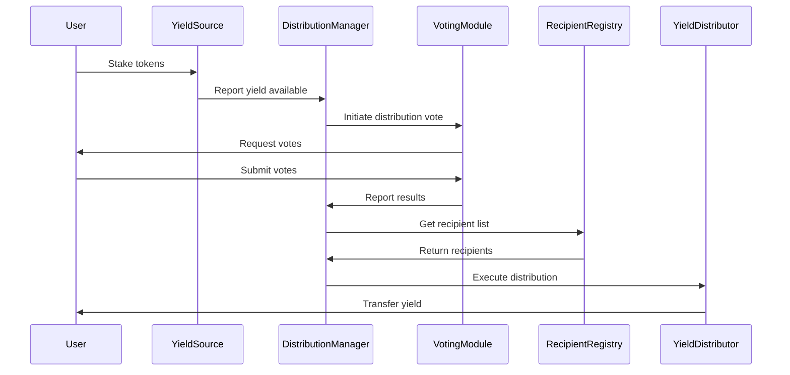
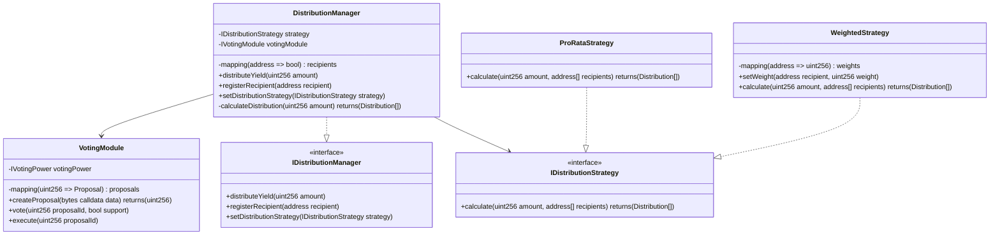

# Issue: Core Distribution System Implementation

## Introduction

The Solidarity Fund requires a complete implementation of the distribution management system to handle yield distribution across member projects. Currently, only interfaces exist without actual implementation, creating a critical gap in the protocol's functionality.

## Problem Statement

The current codebase has fundamental implementation gaps:
- Distribution Manager only exists as an interface
- DefaultYieldClaimer.sol contains TODO comments instead of implementation
- No vote aggregation or tallying mechanisms exist
- Automation architecture delegates to non-existent contracts

This prevents the protocol from functioning as intended and blocks all downstream features.

## Technical Architecture

### Sequence Diagram - Distribution Flow



### Class Diagram - Core Components



## Code Implementation

### DistributionManager.sol

```solidity
// SPDX-License-Identifier: MIT
pragma solidity ^0.8.20;

import "@openzeppelin/contracts-upgradeable/proxy/utils/Initializable.sol";
import "@openzeppelin/contracts-upgradeable/access/AccessControlUpgradeable.sol";
import "@openzeppelin/contracts-upgradeable/security/ReentrancyGuardUpgradeable.sol";
import "./interfaces/IDistributionManager.sol";
import "./interfaces/IDistributionStrategy.sol";
import "./interfaces/IVotingModule.sol";

contract DistributionManager is
    Initializable,
    AccessControlUpgradeable,
    ReentrancyGuardUpgradeable,
    IDistributionManager
{
    bytes32 public constant DISTRIBUTOR_ROLE = keccak256("DISTRIBUTOR_ROLE");

    IDistributionStrategy public distributionStrategy;
    IVotingModule public votingModule;
    address public yieldToken;

    mapping(address => bool) public recipients;
    address[] public recipientList;

    struct Distribution {
        address recipient;
        uint256 amount;
    }

    event YieldDistributed(uint256 totalAmount, uint256 recipientCount);
    event RecipientAdded(address indexed recipient);
    event RecipientRemoved(address indexed recipient);
    event StrategyUpdated(address indexed newStrategy);

    function initialize(
        address _yieldToken,
        address _votingModule,
        address _initialStrategy
    ) public initializer {
        __AccessControl_init();
        __ReentrancyGuard_init();

        _grantRole(DEFAULT_ADMIN_ROLE, msg.sender);
        _grantRole(DISTRIBUTOR_ROLE, msg.sender);

        yieldToken = _yieldToken;
        votingModule = IVotingModule(_votingModule);
        distributionStrategy = IDistributionStrategy(_initialStrategy);
    }

    function distributeYield(
        uint256 amount
    ) external onlyRole(DISTRIBUTOR_ROLE) nonReentrant {
        require(amount > 0, "Amount must be greater than 0");
        require(recipientList.length > 0, "No recipients registered");

        // Calculate distribution based on strategy
        Distribution[] memory distributions = _calculateDistribution(amount);

        // Execute transfers
        for (uint256 i = 0; i < distributions.length; i++) {
            IERC20(yieldToken).transfer(
                distributions[i].recipient,
                distributions[i].amount
            );
        }

        emit YieldDistributed(amount, distributions.length);
    }

    function _calculateDistribution(
        uint256 amount
    ) internal view returns (Distribution[] memory) {
        return distributionStrategy.calculate(amount, recipientList);
    }

    function addRecipient(address recipient) external onlyRole(DEFAULT_ADMIN_ROLE) {
        require(recipient != address(0), "Invalid recipient");
        require(!recipients[recipient], "Already registered");

        recipients[recipient] = true;
        recipientList.push(recipient);

        emit RecipientAdded(recipient);
    }

    function removeRecipient(address recipient) external onlyRole(DEFAULT_ADMIN_ROLE) {
        require(recipients[recipient], "Not registered");

        recipients[recipient] = false;

        // Remove from list
        for (uint256 i = 0; i < recipientList.length; i++) {
            if (recipientList[i] == recipient) {
                recipientList[i] = recipientList[recipientList.length - 1];
                recipientList.pop();
                break;
            }
        }

        emit RecipientRemoved(recipient);
    }

    function updateStrategy(
        address newStrategy
    ) external onlyRole(DEFAULT_ADMIN_ROLE) {
        require(newStrategy != address(0), "Invalid strategy");
        distributionStrategy = IDistributionStrategy(newStrategy);
        emit StrategyUpdated(newStrategy);
    }
}
```

### DefaultYieldClaimer.sol

```solidity
// SPDX-License-Identifier: MIT
pragma solidity ^0.8.20;

import "./interfaces/IYieldClaimer.sol";
import "./DistributionManager.sol";

contract DefaultYieldClaimer is IYieldClaimer {
    DistributionManager public immutable distributionManager;
    mapping(address => uint256) public lastClaim;
    uint256 public constant CLAIM_COOLDOWN = 1 days;

    event YieldClaimed(address indexed claimant, uint256 amount);

    constructor(address _distributionManager) {
        distributionManager = DistributionManager(_distributionManager);
    }

    function claimYield() external override returns (uint256) {
        require(
            block.timestamp >= lastClaim[msg.sender] + CLAIM_COOLDOWN,
            "Cooldown period not met"
        );

        uint256 claimableAmount = getClaimableAmount(msg.sender);
        require(claimableAmount > 0, "No yield to claim");

        lastClaim[msg.sender] = block.timestamp;

        // Trigger distribution through manager
        distributionManager.distributeYield(claimableAmount);

        emit YieldClaimed(msg.sender, claimableAmount);
        return claimableAmount;
    }

    function getClaimableAmount(address user) public view override returns (uint256) {
        // Implementation depends on yield source integration
        // This is a simplified example
        return 100 * 10**18; // 100 tokens
    }
}
```

## Testing Requirements

```solidity
// test/DistributionManager.t.sol
contract DistributionManagerTest is Test {
    function testDistributeYield() public {
        // Setup
        uint256 amount = 1000 * 10**18;

        // Add recipients
        manager.addRecipient(alice);
        manager.addRecipient(bob);

        // Execute distribution
        manager.distributeYield(amount);

        // Verify balances
        assertEq(token.balanceOf(alice), 500 * 10**18);
        assertEq(token.balanceOf(bob), 500 * 10**18);
    }

    function testVotingIntegration() public {
        // Create distribution proposal
        uint256 proposalId = votingModule.createProposal(
            abi.encode(1000 * 10**18, recipients)
        );

        // Vote
        vm.prank(alice);
        votingModule.vote(proposalId, true);

        // Execute if passed
        votingModule.execute(proposalId);
    }
}
```

## Dependencies

- OpenZeppelin Contracts Upgradeable v4.9+
- Foundry for testing
- Access control system
- ERC20 token interface

## Acceptance Criteria

- [ ] Distribution Manager fully implemented
- [ ] All interfaces have concrete implementations
- [ ] Vote aggregation functional
- [ ] Automated distribution working
- [ ] 100% test coverage for core functions
- [ ] Gas optimization completed
- [ ] Security audit passed

## Effort Estimate

**Complexity**: 5 (Very Complex - 1+ week)

This is a foundational component that requires careful design and implementation as all other features depend on it.