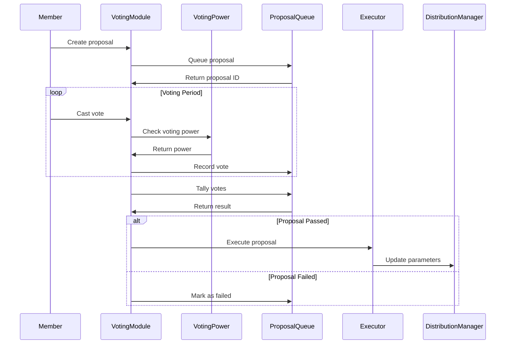
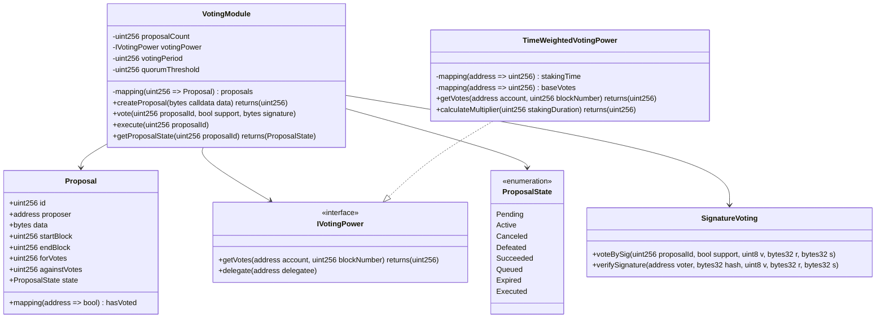

# Issue: Voting Module Implementation

## Introduction

The voting module is essential for governance in the Solidarity Fund, allowing members to vote on yield distribution strategies, recipient additions, and protocol parameters. Currently missing vote aggregation and execution mechanisms.

## Problem Statement

Current gaps in the voting system:
- No vote tallying mechanism
- Missing execution logic for passed proposals
- Incomplete signature-based voting
- No support for multiple voting strategies
- Missing time-weighted voting power implementation

## Technical Architecture

### Sequence Diagram - Voting Flow



### Class Diagram - Voting System



## Code Implementation

### VotingModule.sol

```solidity
// SPDX-License-Identifier: MIT
pragma solidity ^0.8.20;

import "@openzeppelin/contracts-upgradeable/governance/GovernorUpgradeable.sol";
import "@openzeppelin/contracts-upgradeable/governance/extensions/GovernorVotesUpgradeable.sol";
import "./interfaces/IVotingPower.sol";

contract VotingModule is GovernorUpgradeable, GovernorVotesUpgradeable {
    uint256 public constant VOTING_DELAY = 1 days;
    uint256 public constant VOTING_PERIOD = 3 days;
    uint256 public constant QUORUM_PERCENTAGE = 10; // 10%

    mapping(uint256 => ProposalCore) public proposals;
    mapping(uint256 => mapping(address => Receipt)) public receipts;

    struct ProposalCore {
        uint256 id;
        address proposer;
        uint256 eta;
        uint256 startBlock;
        uint256 endBlock;
        uint256 forVotes;
        uint256 againstVotes;
        uint256 abstainVotes;
        bool canceled;
        bool executed;
        mapping(address => bool) hasVoted;
    }

    struct Receipt {
        bool hasVoted;
        uint8 support;
        uint256 votes;
    }

    event ProposalCreated(
        uint256 proposalId,
        address proposer,
        address[] targets,
        uint256[] values,
        string[] signatures,
        bytes[] calldatas,
        uint256 startBlock,
        uint256 endBlock,
        string description
    );

    event VoteCast(
        address indexed voter,
        uint256 proposalId,
        uint8 support,
        uint256 votes,
        string reason
    );

    function propose(
        address[] memory targets,
        uint256[] memory values,
        bytes[] memory calldatas,
        string memory description
    ) public override returns (uint256) {
        require(
            getVotes(msg.sender, block.number - 1) > proposalThreshold(),
            "Governor: proposer votes below proposal threshold"
        );

        uint256 proposalId = hashProposal(targets, values, calldatas, keccak256(bytes(description)));

        ProposalCore storage newProposal = proposals[proposalId];
        require(newProposal.id == 0, "Governor: proposal already exists");

        uint256 startBlock = block.number + VOTING_DELAY;
        uint256 endBlock = startBlock + VOTING_PERIOD;

        newProposal.id = proposalId;
        newProposal.proposer = msg.sender;
        newProposal.startBlock = startBlock;
        newProposal.endBlock = endBlock;

        emit ProposalCreated(
            proposalId,
            msg.sender,
            targets,
            values,
            new string[](targets.length),
            calldatas,
            startBlock,
            endBlock,
            description
        );

        return proposalId;
    }

    function castVote(uint256 proposalId, uint8 support) public returns (uint256) {
        return _castVote(proposalId, msg.sender, support, "");
    }

    function castVoteWithReason(
        uint256 proposalId,
        uint8 support,
        string calldata reason
    ) public returns (uint256) {
        return _castVote(proposalId, msg.sender, support, reason);
    }

    function castVoteBySig(
        uint256 proposalId,
        uint8 support,
        uint8 v,
        bytes32 r,
        bytes32 s
    ) public returns (uint256) {
        bytes32 domainSeparator = keccak256(
            abi.encode(
                keccak256("EIP712Domain(string name,string version,uint256 chainId,address verifyingContract)"),
                keccak256(bytes("VotingModule")),
                keccak256(bytes("1")),
                block.chainid,
                address(this)
            )
        );

        bytes32 structHash = keccak256(
            abi.encode(
                keccak256("Vote(uint256 proposalId,uint8 support)"),
                proposalId,
                support
            )
        );

        bytes32 digest = keccak256(abi.encodePacked("\x19\x01", domainSeparator, structHash));
        address voter = ecrecover(digest, v, r, s);

        require(voter != address(0), "Governor: invalid signature");
        return _castVote(proposalId, voter, support, "");
    }

    function _castVote(
        uint256 proposalId,
        address voter,
        uint8 support,
        string memory reason
    ) internal returns (uint256) {
        require(state(proposalId) == ProposalState.Active, "Governor: vote not currently active");

        ProposalCore storage proposal = proposals[proposalId];
        Receipt storage receipt = receipts[proposalId][voter];

        require(!receipt.hasVoted, "Governor: vote already cast");

        uint256 votes = getVotes(voter, proposal.startBlock);

        if (support == 0) {
            proposal.againstVotes += votes;
        } else if (support == 1) {
            proposal.forVotes += votes;
        } else if (support == 2) {
            proposal.abstainVotes += votes;
        } else {
            revert("Governor: invalid vote type");
        }

        receipt.hasVoted = true;
        receipt.support = support;
        receipt.votes = votes;

        emit VoteCast(voter, proposalId, support, votes, reason);

        return votes;
    }

    function state(uint256 proposalId) public view returns (ProposalState) {
        ProposalCore storage proposal = proposals[proposalId];

        if (proposal.executed) {
            return ProposalState.Executed;
        } else if (proposal.canceled) {
            return ProposalState.Canceled;
        } else if (block.number <= proposal.startBlock) {
            return ProposalState.Pending;
        } else if (block.number <= proposal.endBlock) {
            return ProposalState.Active;
        } else if (proposal.forVotes <= proposal.againstVotes || proposal.forVotes < quorum(proposal.startBlock)) {
            return ProposalState.Defeated;
        } else if (proposal.eta == 0) {
            return ProposalState.Succeeded;
        } else if (block.timestamp >= proposal.eta + GRACE_PERIOD) {
            return ProposalState.Expired;
        } else {
            return ProposalState.Queued;
        }
    }

    function quorum(uint256 blockNumber) public view returns (uint256) {
        return (token.getPastTotalSupply(blockNumber) * QUORUM_PERCENTAGE) / 100;
    }

    function proposalThreshold() public pure returns (uint256) {
        return 1000 * 10**18; // 1000 tokens
    }
}
```

### TimeWeightedVotingPower.sol

```solidity
// SPDX-License-Identifier: MIT
pragma solidity ^0.8.20;

import "./interfaces/IVotingPower.sol";

contract TimeWeightedVotingPower is IVotingPower {
    mapping(address => uint256) public stakingStartTime;
    mapping(address => uint256) public baseVotingPower;
    mapping(address => address) public delegates;

    uint256 public constant MAX_MULTIPLIER = 200; // 2x max
    uint256 public constant TIME_TO_MAX = 365 days;

    event DelegateChanged(address indexed delegator, address indexed fromDelegate, address indexed toDelegate);

    function stake(uint256 amount) external {
        if (stakingStartTime[msg.sender] == 0) {
            stakingStartTime[msg.sender] = block.timestamp;
        }
        baseVotingPower[msg.sender] += amount;
    }

    function getVotes(address account, uint256 blockNumber) external view override returns (uint256) {
        address delegatee = delegates[account];
        if (delegatee == address(0)) {
            delegatee = account;
        }

        uint256 stakingDuration = block.timestamp - stakingStartTime[delegatee];
        uint256 multiplier = calculateMultiplier(stakingDuration);

        return (baseVotingPower[delegatee] * multiplier) / 100;
    }

    function calculateMultiplier(uint256 stakingDuration) public pure returns (uint256) {
        if (stakingDuration >= TIME_TO_MAX) {
            return MAX_MULTIPLIER;
        }

        // Linear increase from 100% to 200% over one year
        return 100 + (stakingDuration * 100) / TIME_TO_MAX;
    }

    function delegate(address delegatee) external override {
        address currentDelegate = delegates[msg.sender];
        require(delegatee != currentDelegate, "Already delegated to this address");

        delegates[msg.sender] = delegatee;
        emit DelegateChanged(msg.sender, currentDelegate, delegatee);
    }

    function getPastVotes(address account, uint256 blockNumber) external view returns (uint256) {
        // Simplified - in production, this would need checkpoint system
        return this.getVotes(account, blockNumber);
    }
}
```

## Testing Requirements

```solidity
// test/VotingModule.t.sol
contract VotingModuleTest is Test {
    function testProposalCreation() public {
        address[] memory targets = new address[](1);
        targets[0] = address(distributionManager);

        uint256[] memory values = new uint256[](1);
        bytes[] memory calldatas = new bytes[](1);
        calldatas[0] = abi.encodeWithSignature("updateStrategy(address)", newStrategy);

        uint256 proposalId = votingModule.propose(
            targets,
            values,
            calldatas,
            "Update distribution strategy"
        );

        assertEq(votingModule.state(proposalId), ProposalState.Pending);
    }

    function testVoteCasting() public {
        // Create proposal
        uint256 proposalId = createTestProposal();

        // Advance to voting period
        vm.roll(block.number + VOTING_DELAY + 1);

        // Cast votes
        vm.prank(alice);
        votingModule.castVote(proposalId, 1); // For

        vm.prank(bob);
        votingModule.castVote(proposalId, 0); // Against

        // Check vote counts
        (uint256 forVotes, uint256 againstVotes,) = votingModule.proposalVotes(proposalId);
        assertGt(forVotes, 0);
        assertGt(againstVotes, 0);
    }

    function testSignatureVoting() public {
        uint256 proposalId = createTestProposal();

        // Create signature
        bytes32 hash = keccak256(abi.encode(proposalId, 1));
        (uint8 v, bytes32 r, bytes32 s) = vm.sign(alicePrivateKey, hash);

        // Vote by signature
        votingModule.castVoteBySig(proposalId, 1, v, r, s);
    }
}
```

## Dependencies

- OpenZeppelin Governor contracts
- EIP-712 for signature voting
- Time-weighted voting power calculator
- Access control system

## Acceptance Criteria

- [ ] Complete voting module with all functions
- [ ] Signature-based voting functional
- [ ] Time-weighted voting power implemented
- [ ] Vote tallying and execution working
- [ ] Multiple voting strategies supported
- [ ] Gas optimized for large voter counts
- [ ] Full test coverage

## Effort Estimate

**Complexity**: 5 (Very Complex - 1+ week)

The voting module is critical infrastructure requiring careful implementation of cryptographic signatures, vote tallying, and execution logic.