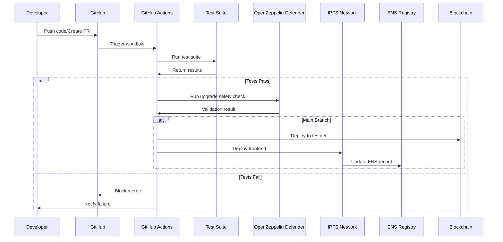
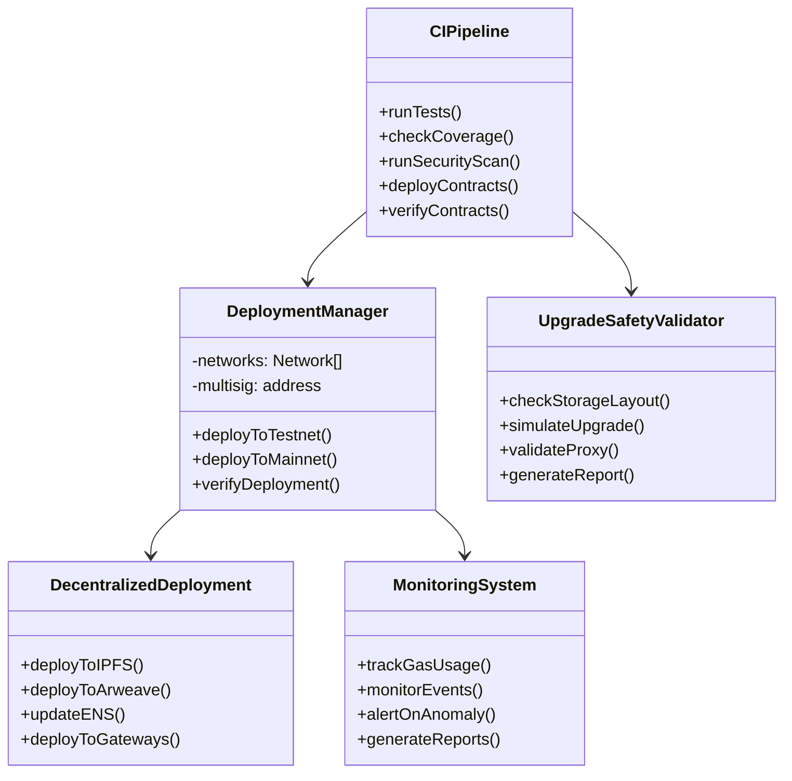

# Issue: CI/CD & Deployment Infrastructure

## Introduction

Implement comprehensive CI/CD pipeline for automated testing, deployment, and decentralized hosting of the Solidarity Fund. This infrastructure ensures code quality, automates deployments, and provides resilient access through multiple gateways.

## Problem Statement

Current infrastructure gaps:
- No automated testing pipeline
- Manual deployment process prone to errors
- No upgrade safety validation
- Centralized frontend hosting
- Missing contract verification automation
- No multi-sig deployment controls

## Technical Architecture

### Sequence Diagram - CI/CD Flow



### Class Diagram - Infrastructure Components



## Implementation

### GitHub Actions Workflow

```yaml
# .github/workflows/ci-cd.yml
name: Solidarity Fund CI/CD

on:
  push:
    branches: [main, develop]
  pull_request:
    branches: [main]

env:
  FOUNDRY_PROFILE: ci

jobs:
  test:
    runs-on: ubuntu-latest
    steps:
      - uses: actions/checkout@v3
        with:
          submodules: recursive

      - name: Install Foundry
        uses: foundry-rs/foundry-toolchain@v1
        with:
          version: nightly

      - name: Install dependencies
        run: forge install

      - name: Run tests
        run: forge test -vvv

      - name: Check coverage
        run: forge coverage --report lcov

      - name: Upload coverage
        uses: codecov/codecov-action@v3
        with:
          files: ./lcov.info
          fail_ci_if_error: true

  security:
    runs-on: ubuntu-latest
    needs: test
    steps:
      - uses: actions/checkout@v3

      - name: Run Slither
        uses: crytic/slither-action@v0.3.0
        with:
          fail-on: high

      - name: Run Mythril
        uses: ConsenSys/mythril-action@v1
        with:
          myth-args: --execution-timeout 300

  upgrade-safety:
    runs-on: ubuntu-latest
    needs: [test, security]
    if: github.ref == 'refs/heads/main'
    steps:
      - uses: actions/checkout@v3

      - name: Setup Node
        uses: actions/setup-node@v3
        with:
          node-version: 18

      - name: Install Hardhat
        run: npm install --save-dev @openzeppelin/hardhat-upgrades

      - name: Check upgrade safety
        run: npx hardhat run scripts/check-upgrade-safety.js

      - name: Validate storage layout
        run: npx hardhat run scripts/validate-storage.js

  deploy-testnet:
    runs-on: ubuntu-latest
    needs: [test, security, upgrade-safety]
    if: github.ref == 'refs/heads/develop'
    steps:
      - uses: actions/checkout@v3

      - name: Deploy to Sepolia
        run: forge script script/Deploy.s.sol:Deploy --rpc-url $SEPOLIA_RPC_URL --broadcast --verify
        env:
          SEPOLIA_RPC_URL: ${{ secrets.SEPOLIA_RPC_URL }}
          PRIVATE_KEY: ${{ secrets.TESTNET_DEPLOYER_KEY }}
          ETHERSCAN_API_KEY: ${{ secrets.ETHERSCAN_API_KEY }}

      - name: Verify contracts
        run: forge verify-contract --chain sepolia --etherscan-api-key ${{ secrets.ETHERSCAN_API_KEY }}

  deploy-frontend:
    runs-on: ubuntu-latest
    needs: deploy-testnet
    steps:
      - uses: actions/checkout@v3

      - name: Build frontend
        run: |
          cd frontend
          npm ci
          npm run build

      - name: Deploy to IPFS
        uses: aquiladev/ipfs-action@v0.3.0
        with:
          path: ./frontend/dist
          service: pinata
          pinataKey: ${{ secrets.PINATA_KEY }}
          pinataSecret: ${{ secrets.PINATA_SECRET }}

      - name: Deploy to Arweave
        run: |
          npm install -g arkb
          arkb deploy ./frontend/dist --wallet ${{ secrets.ARWEAVE_WALLET }}

      - name: Update ENS
        run: |
          node scripts/update-ens.js ${{ steps.ipfs.outputs.hash }}
        env:
          PRIVATE_KEY: ${{ secrets.ENS_UPDATER_KEY }}

  deploy-mainnet:
    runs-on: ubuntu-latest
    needs: [test, security, upgrade-safety]
    if: github.ref == 'refs/heads/main' && github.event_name == 'workflow_dispatch'
    steps:
      - uses: actions/checkout@v3

      - name: Prepare multisig transaction
        run: |
          forge script script/Deploy.s.sol:Deploy \
            --rpc-url $MAINNET_RPC_URL \
            --private-key ${{ secrets.PROPOSER_KEY }} \
            --broadcast \
            --verify \
            --slow

      - name: Create Safe transaction
        uses: safe-global/safe-cli-action@v1
        with:
          safe-address: ${{ secrets.MULTISIG_ADDRESS }}
          transaction-data: ${{ steps.prepare.outputs.data }}
```

### Deployment Script

```solidity
// script/Deploy.s.sol
pragma solidity ^0.8.20;

import "forge-std/Script.sol";
import "../src/DistributionManager.sol";
import "../src/VotingModule.sol";

contract Deploy is Script {
    function run() external {
        uint256 deployerPrivateKey = vm.envUint("PRIVATE_KEY");
        vm.startBroadcast(deployerPrivateKey);

        // Deploy implementation contracts
        DistributionManager distributionImpl = new DistributionManager();
        VotingModule votingImpl = new VotingModule();

        // Deploy proxies
        ERC1967Proxy distributionProxy = new ERC1967Proxy(
            address(distributionImpl),
            abi.encodeWithSelector(
                DistributionManager.initialize.selector,
                vm.envAddress("YIELD_TOKEN"),
                address(votingProxy),
                vm.envAddress("INITIAL_STRATEGY")
            )
        );

        ERC1967Proxy votingProxy = new ERC1967Proxy(
            address(votingImpl),
            abi.encodeWithSelector(
                VotingModule.initialize.selector,
                vm.envAddress("GOVERNANCE_TOKEN")
            )
        );

        // Verify deployments
        console.log("DistributionManager deployed at:", address(distributionProxy));
        console.log("VotingModule deployed at:", address(votingProxy));

        // Save deployment addresses
        string memory json = "deployment";
        vm.serializeAddress(json, "distributionManager", address(distributionProxy));
        vm.serializeAddress(json, "votingModule", address(votingProxy));
        vm.writeJson(json, "./deployments/latest.json");

        vm.stopBroadcast();
    }
}
```

### Upgrade Safety Validator

```javascript
// scripts/check-upgrade-safety.js
const { upgrades } = require("@openzeppelin/hardhat-upgrades");
const hre = require("hardhat");

async function main() {
    console.log("Checking upgrade safety...");

    const contracts = [
        "DistributionManager",
        "VotingModule",
        "YieldDistributor"
    ];

    for (const contractName of contracts) {
        console.log(`Validating ${contractName}...`);

        try {
            const ContractFactory = await hre.ethers.getContractFactory(contractName);
            await upgrades.validateImplementation(ContractFactory);
            console.log(`✓ ${contractName} is upgrade safe`);
        } catch (error) {
            console.error(`✗ ${contractName} failed validation:`, error.message);
            process.exit(1);
        }
    }

    console.log("All contracts are upgrade safe!");
}

main().catch((error) => {
    console.error(error);
    process.exit(1);
});
```

### IPFS Deployment Script

```javascript
// scripts/deploy-ipfs.js
const { create } = require('ipfs-http-client');
const fs = require('fs').promises;
const path = require('path');

const IPFS_GATEWAYS = [
    'https://gateway.pinata.cloud',
    'https://ipfs.io',
    'https://cloudflare-ipfs.com'
];

async function deployToIPFS() {
    const ipfs = create({
        host: 'ipfs.infura.io',
        port: 5001,
        protocol: 'https',
        headers: {
            authorization: `Basic ${Buffer.from(
                `${process.env.INFURA_PROJECT_ID}:${process.env.INFURA_PROJECT_SECRET}`
            ).toString('base64')}`
        }
    });

    const distPath = path.join(__dirname, '../frontend/dist');
    const files = await getFiles(distPath);

    for await (const result of ipfs.addAll(files)) {
        console.log(`Added ${result.path}: ${result.cid}`);
    }

    const rootCID = files[files.length - 1].cid;
    console.log(`Root CID: ${rootCID}`);

    // Pin to multiple services
    await pinToServices(rootCID);

    // Update ENS
    await updateENS(rootCID);

    return rootCID;
}

async function pinToServices(cid) {
    // Pin to Pinata
    const pinataSDK = require('@pinata/sdk');
    const pinata = pinataSDK(
        process.env.PINATA_API_KEY,
        process.env.PINATA_SECRET_KEY
    );

    await pinata.pinByHash(cid, {
        pinataMetadata: {
            name: 'solidarity-fund-frontend',
            keyvalues: {
                version: process.env.VERSION || 'latest'
            }
        }
    });

    console.log(`Pinned to Pinata: ${cid}`);
}

async function updateENS(cid) {
    const { ethers } = require('hardhat');
    const ENS_REGISTRY = '0x00000000000C2E074eC69A0dFb2997BA6C7d2e1e';

    const signer = new ethers.Wallet(process.env.PRIVATE_KEY);
    const ensRegistry = await ethers.getContractAt('ENSRegistry', ENS_REGISTRY, signer);

    const contentHash = `ipfs://${cid}`;
    const tx = await ensRegistry.setContenthash(
        ethers.utils.namehash('solidarityfund.eth'),
        contentHash
    );

    await tx.wait();
    console.log(`ENS updated with content hash: ${contentHash}`);
}
```

## Monitoring Configuration

```yaml
# monitoring/config.yml
monitoring:
  providers:
    - name: OpenZeppelin Defender
      services:
        - sentinel:
            contracts:
              - address: "${DISTRIBUTION_MANAGER}"
                network: mainnet
                abi: DistributionManager
            alerts:
              - name: Large Distribution
                condition: "event.YieldDistributed.totalAmount > 10000e18"
                severity: high
              - name: Recipient Added
                condition: "event.RecipientAdded"
                severity: info

        - autotask:
            schedule: "0 */6 * * *"  # Every 6 hours
            script: |
              const { DefenderRelaySigner } = require('defender-relay-client/lib/ethers');
              const signer = new DefenderRelaySigner(credentials, provider);

              // Check and execute pending distributions
              const pending = await contract.getPendingDistributions();
              if (pending.length > 0) {
                await contract.connect(signer).executeDistributions(pending);
              }

    - name: Grafana
      datasources:
        - prometheus:
            metrics:
              - gas_used_per_transaction
              - transaction_success_rate
              - contract_balance
              - unique_users_daily
      dashboards:
        - protocol_health
        - gas_optimization
        - user_activity
```

## Dependencies

- GitHub Actions for CI/CD
- Foundry for contract testing/deployment
- OpenZeppelin Defender for monitoring
- IPFS/Pinata for decentralized storage
- ENS for domain resolution
- Safe (Gnosis) for multi-sig
- Slither/Mythril for security scanning

## Acceptance Criteria

- [ ] Automated testing on every PR
- [ ] Security scanning integrated
- [ ] Upgrade safety validation working
- [ ] Automatic testnet deployment
- [ ] Multi-sig mainnet deployment
- [ ] IPFS deployment functional
- [ ] ENS integration complete
- [ ] Multiple gateway deployment
- [ ] Monitoring and alerting active

## Effort Estimate

**Complexity**: 3 (Moderate - 1-3 days)

While complex in scope, much of this can be implemented using existing tools and templates. The main effort is in configuration and testing.