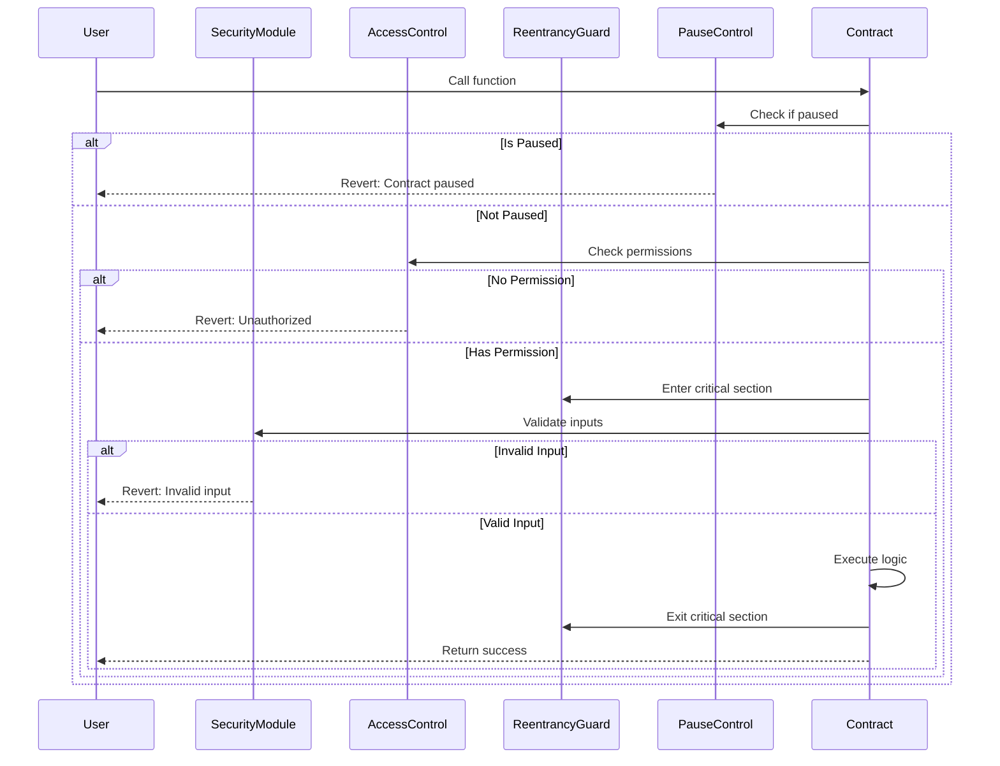
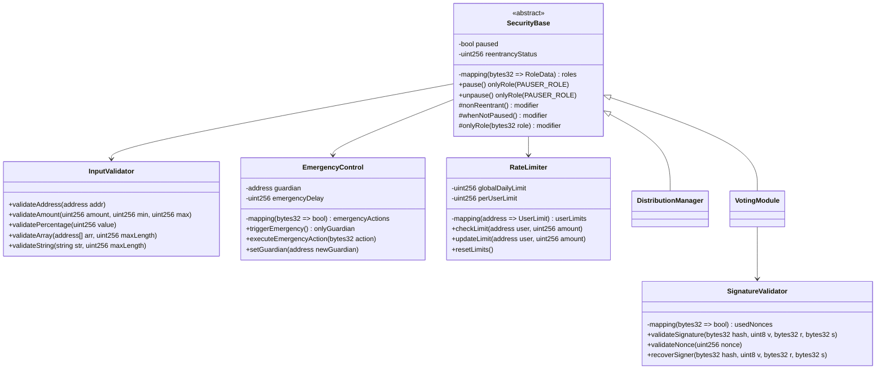

# Issue: Security Hardening & Testing

## Introduction

Implement comprehensive security measures including reentrancy guards, emergency pause mechanisms, input validation, and extensive testing coverage to ensure the Solidarity Fund protocol is production-ready and secure against common attack vectors.

## Problem Statement

Current security vulnerabilities:
- Missing reentrancy protection on critical functions
- No emergency pause mechanism for incident response
- Inconsistent Solidity versions creating compatibility risks
- Insufficient input validation
- Low test coverage (only 59 tests)
- No fuzz testing or formal verification
- Missing security scanning in CI/CD

## Technical Architecture

### Sequence Diagram - Security Controls



### Class Diagram - Security Components



## Code Implementation

### SecurityBase.sol

```solidity
// SPDX-License-Identifier: MIT
pragma solidity ^0.8.20;

import "@openzeppelin/contracts-upgradeable/security/ReentrancyGuardUpgradeable.sol";
import "@openzeppelin/contracts-upgradeable/security/PausableUpgradeable.sol";
import "@openzeppelin/contracts-upgradeable/access/AccessControlUpgradeable.sol";

abstract contract SecurityBase is
    ReentrancyGuardUpgradeable,
    PausableUpgradeable,
    AccessControlUpgradeable
{
    bytes32 public constant PAUSER_ROLE = keccak256("PAUSER_ROLE");
    bytes32 public constant GUARDIAN_ROLE = keccak256("GUARDIAN_ROLE");

    // Rate limiting
    mapping(address => uint256) public lastActionTimestamp;
    uint256 public constant ACTION_COOLDOWN = 1 minutes;

    // Emergency shutdown
    bool public emergencyShutdown;
    uint256 public emergencyShutdownTime;

    event EmergencyShutdown(address indexed triggeredBy, uint256 timestamp);
    event EmergencyResolved(address indexed resolvedBy, uint256 timestamp);

    function __SecurityBase_init() internal onlyInitializing {
        __ReentrancyGuard_init();
        __Pausable_init();
        __AccessControl_init();

        _grantRole(DEFAULT_ADMIN_ROLE, msg.sender);
        _grantRole(PAUSER_ROLE, msg.sender);
        _grantRole(GUARDIAN_ROLE, msg.sender);
    }

    modifier rateLimited() {
        require(
            block.timestamp >= lastActionTimestamp[msg.sender] + ACTION_COOLDOWN,
            "SecurityBase: Action on cooldown"
        );
        lastActionTimestamp[msg.sender] = block.timestamp;
        _;
    }

    modifier notEmergencyShutdown() {
        require(!emergencyShutdown, "SecurityBase: Emergency shutdown active");
        _;
    }

    function pause() external onlyRole(PAUSER_ROLE) {
        _pause();
    }

    function unpause() external onlyRole(PAUSER_ROLE) {
        _unpause();
    }

    function triggerEmergencyShutdown() external onlyRole(GUARDIAN_ROLE) {
        emergencyShutdown = true;
        emergencyShutdownTime = block.timestamp;
        _pause();
        emit EmergencyShutdown(msg.sender, block.timestamp);
    }

    function resolveEmergency() external onlyRole(DEFAULT_ADMIN_ROLE) {
        require(emergencyShutdown, "SecurityBase: No emergency active");
        require(
            block.timestamp >= emergencyShutdownTime + 24 hours,
            "SecurityBase: Emergency cooldown not met"
        );

        emergencyShutdown = false;
        _unpause();
        emit EmergencyResolved(msg.sender, block.timestamp);
    }
}
```

### InputValidator.sol

```solidity
// SPDX-License-Identifier: MIT
pragma solidity ^0.8.20;

library InputValidator {
    error InvalidAddress(address addr);
    error InvalidAmount(uint256 amount);
    error InvalidPercentage(uint256 value);
    error ArrayTooLong(uint256 length, uint256 maxLength);
    error StringTooLong(uint256 length, uint256 maxLength);
    error ZeroAmount();

    function validateAddress(address addr) internal pure {
        if (addr == address(0)) {
            revert InvalidAddress(addr);
        }
    }

    function validateAmount(
        uint256 amount,
        uint256 min,
        uint256 max
    ) internal pure {
        if (amount == 0) {
            revert ZeroAmount();
        }
        if (amount < min || amount > max) {
            revert InvalidAmount(amount);
        }
    }

    function validatePercentage(uint256 value) internal pure {
        if (value > 10000) { // 100.00%
            revert InvalidPercentage(value);
        }
    }

    function validateArray(
        address[] memory arr,
        uint256 maxLength
    ) internal pure {
        if (arr.length == 0) {
            revert ArrayTooLong(0, maxLength);
        }
        if (arr.length > maxLength) {
            revert ArrayTooLong(arr.length, maxLength);
        }

        for (uint256 i = 0; i < arr.length; i++) {
            validateAddress(arr[i]);
            // Check for duplicates
            for (uint256 j = i + 1; j < arr.length; j++) {
                require(arr[i] != arr[j], "Duplicate address in array");
            }
        }
    }

    function validateString(
        string memory str,
        uint256 maxLength
    ) internal pure {
        uint256 length = bytes(str).length;
        if (length == 0 || length > maxLength) {
            revert StringTooLong(length, maxLength);
        }
    }
}
```

### SecureDistributionManager.sol

```solidity
// SPDX-License-Identifier: MIT
pragma solidity ^0.8.20;

import "./SecurityBase.sol";
import "./InputValidator.sol";

contract SecureDistributionManager is SecurityBase {
    using InputValidator for address;
    using InputValidator for uint256;
    using InputValidator for address[];

    uint256 public constant MAX_DISTRIBUTION_AMOUNT = 1000000 * 10**18;
    uint256 public constant MIN_DISTRIBUTION_AMOUNT = 1 * 10**18;
    uint256 public constant MAX_RECIPIENTS = 100;

    mapping(address => uint256) public dailyDistributed;
    mapping(uint256 => uint256) public dayToTotal;
    uint256 public dailyLimit = 100000 * 10**18;

    event DailyLimitUpdated(uint256 oldLimit, uint256 newLimit);

    function distributeYield(
        uint256 amount,
        address[] calldata recipients
    ) external
        whenNotPaused
        notEmergencyShutdown
        nonReentrant
        onlyRole(DISTRIBUTOR_ROLE)
    {
        // Input validation
        amount.validateAmount(MIN_DISTRIBUTION_AMOUNT, MAX_DISTRIBUTION_AMOUNT);
        recipients.validateArray(MAX_RECIPIENTS);

        // Check daily limit
        uint256 today = block.timestamp / 1 days;
        require(
            dayToTotal[today] + amount <= dailyLimit,
            "Daily distribution limit exceeded"
        );

        // Update daily tracking
        dayToTotal[today] += amount;

        // Perform distribution
        _performDistribution(amount, recipients);
    }

    function _performDistribution(
        uint256 amount,
        address[] calldata recipients
    ) private {
        uint256 amountPerRecipient = amount / recipients.length;

        for (uint256 i = 0; i < recipients.length; i++) {
            // Additional safety checks
            require(
                recipients[i] != address(this),
                "Cannot distribute to self"
            );

            IERC20(yieldToken).safeTransfer(
                recipients[i],
                amountPerRecipient
            );

            emit YieldDistributed(recipients[i], amountPerRecipient);
        }
    }

    function updateDailyLimit(uint256 newLimit) external onlyRole(DEFAULT_ADMIN_ROLE) {
        newLimit.validateAmount(MIN_DISTRIBUTION_AMOUNT, MAX_DISTRIBUTION_AMOUNT * 10);

        uint256 oldLimit = dailyLimit;
        dailyLimit = newLimit;

        emit DailyLimitUpdated(oldLimit, newLimit);
    }
}
```

### Comprehensive Test Suite

```solidity
// test/Security.t.sol
pragma solidity ^0.8.20;

import "forge-std/Test.sol";
import "../src/SecureDistributionManager.sol";

contract SecurityTest is Test {
    SecureDistributionManager manager;
    address attacker = address(0xBad);

    function setUp() public {
        manager = new SecureDistributionManager();
        manager.initialize(token, votingModule, strategy);
    }

    function testReentrancyProtection() public {
        // Deploy malicious contract
        ReentrancyAttacker attackContract = new ReentrancyAttacker(manager);

        vm.expectRevert("ReentrancyGuard: reentrant call");
        attackContract.attack();
    }

    function testPauseFunction() public {
        // Pause contract
        manager.pause();

        // Try to distribute while paused
        vm.expectRevert("Pausable: paused");
        manager.distributeYield(1000e18, recipients);

        // Unpause
        manager.unpause();

        // Should work now
        manager.distributeYield(1000e18, recipients);
    }

    function testEmergencyShutdown() public {
        // Trigger emergency
        manager.triggerEmergencyShutdown();

        // All functions should be blocked
        vm.expectRevert("SecurityBase: Emergency shutdown active");
        manager.distributeYield(1000e18, recipients);

        // Fast forward 24 hours
        vm.warp(block.timestamp + 24 hours);

        // Resolve emergency
        manager.resolveEmergency();

        // Should work now
        manager.distributeYield(1000e18, recipients);
    }

    function testInputValidation() public {
        // Test zero amount
        vm.expectRevert(InputValidator.ZeroAmount.selector);
        manager.distributeYield(0, recipients);

        // Test invalid address
        address[] memory badRecipients = new address[](1);
        badRecipients[0] = address(0);

        vm.expectRevert(
            abi.encodeWithSelector(
                InputValidator.InvalidAddress.selector,
                address(0)
            )
        );
        manager.distributeYield(1000e18, badRecipients);

        // Test array too long
        address[] memory tooManyRecipients = new address[](101);
        vm.expectRevert(
            abi.encodeWithSelector(
                InputValidator.ArrayTooLong.selector,
                101,
                100
            )
        );
        manager.distributeYield(1000e18, tooManyRecipients);
    }

    function testDailyLimit() public {
        // Distribute up to limit
        manager.distributeYield(dailyLimit, recipients);

        // Try to exceed limit
        vm.expectRevert("Daily distribution limit exceeded");
        manager.distributeYield(1e18, recipients);

        // Fast forward to next day
        vm.warp(block.timestamp + 1 days);

        // Should work now
        manager.distributeYield(1e18, recipients);
    }

    function testFuzzDistribution(
        uint256 amount,
        address[] memory recipients
    ) public {
        // Bound inputs
        amount = bound(amount, MIN_DISTRIBUTION_AMOUNT, MAX_DISTRIBUTION_AMOUNT);
        vm.assume(recipients.length > 0 && recipients.length <= MAX_RECIPIENTS);

        // Filter out invalid addresses
        for (uint256 i = 0; i < recipients.length; i++) {
            vm.assume(recipients[i] != address(0));
            vm.assume(recipients[i] != address(manager));
        }

        // Should not revert with valid inputs
        manager.distributeYield(amount, recipients);
    }
}
```

### Slither Configuration

```yaml
# slither.config.json
{
  "detectors_to_exclude": [
    "naming-convention",
    "solc-version"
  ],
  "detectors_to_run": [
    "reentrancy-eth",
    "reentrancy-no-eth",
    "reentrancy-unlimited-gas",
    "unchecked-transfer",
    "uninitialized-storage",
    "arbitrary-send",
    "controlled-delegatecall",
    "delegatecall-loop",
    "msg-value-loop",
    "reentrancy-benign",
    "reentrancy-events",
    "timestamp",
    "assembly",
    "assert-state-change",
    "boolean-cst",
    "constant-function-asm",
    "constant-function-state",
    "divide-before-multiply",
    "locked-ether",
    "msgvalue-loop",
    "tx-origin",
    "unchecked-lowlevel",
    "unchecked-send",
    "uninitialized-local",
    "unused-return"
  ],
  "filter_paths": "node_modules|lib",
  "solc_remaps": [
    "@openzeppelin=node_modules/@openzeppelin"
  ]
}
```

## Testing Strategy

### Unit Tests
- Test each function in isolation
- Mock external dependencies
- Test edge cases and boundaries

### Integration Tests
- Test component interactions
- Verify state transitions
- Test upgrade paths

### Fuzz Testing
- Random input generation
- Property-based testing
- Invariant checking

### Security Testing
- Reentrancy scenarios
- Access control verification
- Input validation edge cases

## Dependencies

- OpenZeppelin security contracts
- Foundry for testing
- Slither for static analysis
- Echidna for fuzz testing
- Manticore for symbolic execution

## Acceptance Criteria

- [ ] All functions have reentrancy protection
- [ ] Emergency pause mechanism functional
- [ ] Input validation on all external functions
- [ ] 100% test coverage achieved
- [ ] Fuzz testing implemented
- [ ] Security scan passing
- [ ] Daily limits enforced
- [ ] Rate limiting active
- [ ] Audit recommendations implemented

## Effort Estimate

**Complexity**: 4 (Complex - 3-5 days)

Security hardening requires careful implementation and extensive testing. Each security measure must be thoroughly validated.