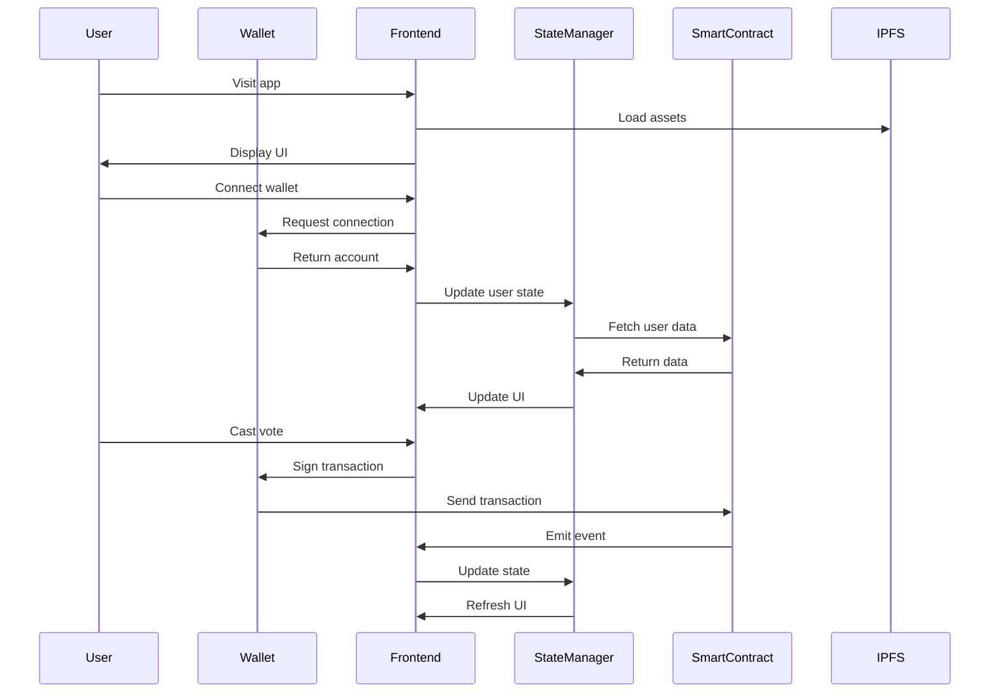
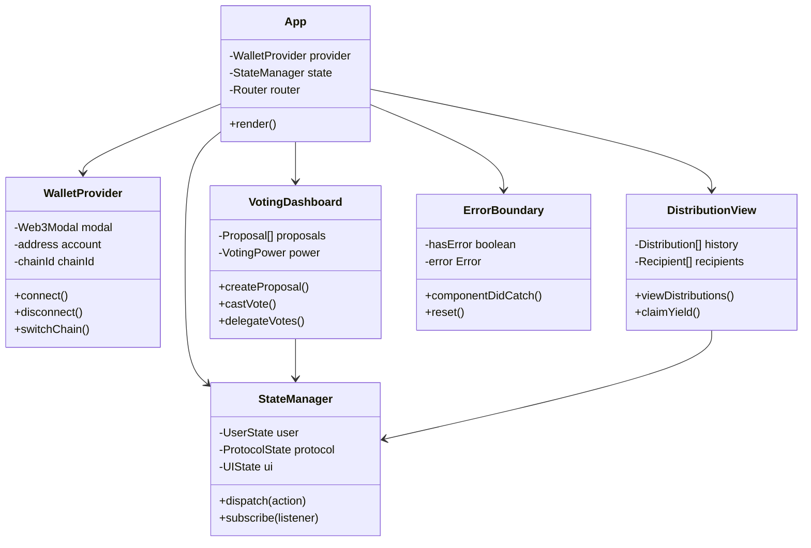

# Issue: Frontend Rebrand & Feature Implementation

## Introduction

Complete the Solidarity Fund frontend rebrand to align with the new Bread Cooperative design system while implementing missing features including wallet integration, state management, and user interface components for voting and distribution visualization.

## Problem Statement

Current frontend gaps:
- No Web3 wallet integration
- Missing global state management
- No React error boundaries
- Incomplete UI components
- Missing CSP headers for security
- No input validation framework
- Using unstable React 19 version
- Mixed dependency versions

## Technical Architecture

### Sequence Diagram - User Interaction Flow



### Component Architecture



## Implementation

### Package Configuration

```json
// package.json
{
  "name": "solidarity-fund-app",
  "version": "1.0.0",
  "type": "module",
  "scripts": {
    "dev": "vite",
    "build": "tsc && vite build",
    "preview": "vite preview",
    "test": "vitest",
    "lint": "eslint src --ext ts,tsx",
    "type-check": "tsc --noEmit"
  },
  "dependencies": {
    "react": "^18.2.0",
    "react-dom": "^18.2.0",
    "react-router-dom": "^6.20.0",
    "@web3modal/ethers": "^4.0.0",
    "ethers": "^6.9.0",
    "zustand": "^4.4.0",
    "@tanstack/react-query": "^5.0.0",
    "@radix-ui/react-dialog": "^1.0.5",
    "@radix-ui/react-select": "^2.0.0",
    "@radix-ui/react-tabs": "^1.0.4",
    "@radix-ui/react-toast": "^1.1.5",
    "react-hook-form": "^7.48.0",
    "zod": "^3.22.0",
    "@hookform/resolvers": "^3.3.0",
    "class-variance-authority": "^0.7.0",
    "clsx": "^2.0.0",
    "tailwind-merge": "^2.1.0"
  },
  "devDependencies": {
    "@types/react": "^18.2.0",
    "@types/react-dom": "^18.2.0",
    "@typescript-eslint/eslint-plugin": "^6.14.0",
    "@typescript-eslint/parser": "^6.14.0",
    "@vitejs/plugin-react": "^4.2.0",
    "autoprefixer": "^10.4.16",
    "eslint": "^8.55.0",
    "postcss": "^8.4.32",
    "tailwindcss": "^3.3.6",
    "typescript": "^5.3.3",
    "vite": "^5.0.0",
    "vitest": "^1.0.0"
  }
}
```

### Wallet Integration

```typescript
// src/providers/WalletProvider.tsx
import { createWeb3Modal, defaultConfig } from '@web3modal/ethers/react';
import { ReactNode, useEffect } from 'react';

const projectId = import.meta.env.VITE_WALLET_CONNECT_PROJECT_ID;

const mainnet = {
  chainId: 1,
  name: 'Ethereum',
  currency: 'ETH',
  explorerUrl: 'https://etherscan.io',
  rpcUrl: 'https://eth.public-rpc.com'
};

const sepolia = {
  chainId: 11155111,
  name: 'Sepolia',
  currency: 'ETH',
  explorerUrl: 'https://sepolia.etherscan.io',
  rpcUrl: 'https://rpc.sepolia.org'
};

const metadata = {
  name: 'Solidarity Fund',
  description: 'Decentralized yield distribution for solidarity economy',
  url: 'https://solidarityfund.eth',
  icons: ['https://solidarityfund.eth/logo.png']
};

const ethersConfig = defaultConfig({
  metadata,
  enableEIP6963: true,
  enableInjected: true,
  enableCoinbase: true,
  rpcUrl: 'https://eth.public-rpc.com',
  defaultChainId: 1
});

createWeb3Modal({
  ethersConfig,
  chains: [mainnet, sepolia],
  projectId,
  enableAnalytics: true,
  themeMode: 'light',
  themeVariables: {
    '--w3m-accent': '#FF6B35', // Bread orange
    '--w3m-border-radius-master': '12px'
  }
});

export function WalletProvider({ children }: { children: ReactNode }) {
  return <>{children}</>;
}
```

### State Management

```typescript
// src/store/index.ts
import { create } from 'zustand';
import { devtools, persist } from 'zustand/middleware';
import { immer } from 'zustand/middleware/immer';

interface UserState {
  address: string | null;
  balance: bigint;
  votingPower: bigint;
  isConnected: boolean;
}

interface ProtocolState {
  proposals: Proposal[];
  distributions: Distribution[];
  recipients: Recipient[];
  totalYield: bigint;
}

interface AppState {
  user: UserState;
  protocol: ProtocolState;
  setUser: (user: Partial<UserState>) => void;
  setProtocol: (protocol: Partial<ProtocolState>) => void;
  reset: () => void;
}

const initialState = {
  user: {
    address: null,
    balance: 0n,
    votingPower: 0n,
    isConnected: false
  },
  protocol: {
    proposals: [],
    distributions: [],
    recipients: [],
    totalYield: 0n
  }
};

export const useStore = create<AppState>()(
  devtools(
    persist(
      immer((set) => ({
        ...initialState,

        setUser: (user) => set((state) => {
          Object.assign(state.user, user);
        }),

        setProtocol: (protocol) => set((state) => {
          Object.assign(state.protocol, protocol);
        }),

        reset: () => set(() => initialState)
      })),
      {
        name: 'solidarity-fund-store',
        partialize: (state) => ({ user: state.user })
      }
    )
  )
);
```

### Error Boundary

```typescript
// src/components/ErrorBoundary.tsx
import { Component, ReactNode } from 'react';

interface Props {
  children: ReactNode;
  fallback?: ReactNode;
}

interface State {
  hasError: boolean;
  error: Error | null;
}

export class ErrorBoundary extends Component<Props, State> {
  constructor(props: Props) {
    super(props);
    this.state = { hasError: false, error: null };
  }

  static getDerivedStateFromError(error: Error): State {
    return { hasError: true, error };
  }

  componentDidCatch(error: Error, errorInfo: any) {
    console.error('ErrorBoundary caught:', error, errorInfo);

    // Send to error tracking service
    if (import.meta.env.PROD) {
      // Sentry or similar service
      captureException(error, { extra: errorInfo });
    }
  }

  render() {
    if (this.state.hasError) {
      return this.props.fallback || (
        <div className="error-container">
          <h2>Something went wrong</h2>
          <details>
            <summary>Error details</summary>
            <pre>{this.state.error?.stack}</pre>
          </details>
          <button onClick={() => this.setState({ hasError: false, error: null })}>
            Try again
          </button>
        </div>
      );
    }

    return this.props.children;
  }
}
```

### Voting Dashboard Component

```typescript
// src/components/VotingDashboard.tsx
import { useWeb3ModalProvider, useWeb3ModalAccount } from '@web3modal/ethers/react';
import { BrowserProvider, Contract } from 'ethers';
import { useQuery, useMutation } from '@tanstack/react-query';
import { useForm } from 'react-hook-form';
import { zodResolver } from '@hookform/resolvers/zod';
import { z } from 'zod';

const proposalSchema = z.object({
  title: z.string().min(10).max(100),
  description: z.string().min(50).max(1000),
  targets: z.array(z.string().regex(/^0x[a-fA-F0-9]{40}$/)),
  values: z.array(z.string()),
  calldatas: z.array(z.string())
});

export function VotingDashboard() {
  const { address, isConnected } = useWeb3ModalAccount();
  const { walletProvider } = useWeb3ModalProvider();

  const { data: proposals, isLoading } = useQuery({
    queryKey: ['proposals'],
    queryFn: fetchProposals,
    enabled: isConnected
  });

  const voteMutation = useMutation({
    mutationFn: castVote,
    onSuccess: () => {
      queryClient.invalidateQueries({ queryKey: ['proposals'] });
      toast.success('Vote cast successfully!');
    },
    onError: (error) => {
      toast.error(`Failed to cast vote: ${error.message}`);
    }
  });

  const form = useForm({
    resolver: zodResolver(proposalSchema),
    defaultValues: {
      title: '',
      description: '',
      targets: [],
      values: [],
      calldatas: []
    }
  });

  async function fetchProposals() {
    if (!walletProvider) return [];

    const ethersProvider = new BrowserProvider(walletProvider);
    const signer = await ethersProvider.getSigner();
    const contract = new Contract(VOTING_ADDRESS, VOTING_ABI, signer);

    const proposalCount = await contract.proposalCount();
    const proposals = [];

    for (let i = 1; i <= proposalCount; i++) {
      const proposal = await contract.proposals(i);
      proposals.push(proposal);
    }

    return proposals;
  }

  async function castVote(data: { proposalId: bigint; support: boolean }) {
    if (!walletProvider) throw new Error('Wallet not connected');

    const ethersProvider = new BrowserProvider(walletProvider);
    const signer = await ethersProvider.getSigner();
    const contract = new Contract(VOTING_ADDRESS, VOTING_ABI, signer);

    const tx = await contract.castVote(data.proposalId, data.support ? 1 : 0);
    await tx.wait();
  }

  return (
    <div className="voting-dashboard">
      <header className="dashboard-header">
        <h1>Governance Dashboard</h1>
        <div className="voting-power">
          Voting Power: {formatVotingPower(votingPower)}
        </div>
      </header>

      <section className="create-proposal">
        <h2>Create Proposal</h2>
        <form onSubmit={form.handleSubmit(onSubmit)}>
          <input
            {...form.register('title')}
            placeholder="Proposal title"
            className="input-field"
          />
          {form.formState.errors.title && (
            <span className="error">{form.formState.errors.title.message}</span>
          )}

          <textarea
            {...form.register('description')}
            placeholder="Detailed description"
            className="textarea-field"
          />
          {form.formState.errors.description && (
            <span className="error">{form.formState.errors.description.message}</span>
          )}

          <button type="submit" disabled={form.formState.isSubmitting}>
            Submit Proposal
          </button>
        </form>
      </section>

      <section className="proposals-list">
        <h2>Active Proposals</h2>
        {isLoading ? (
          <div className="loading">Loading proposals...</div>
        ) : (
          <div className="proposals-grid">
            {proposals?.map((proposal) => (
              <ProposalCard
                key={proposal.id}
                proposal={proposal}
                onVote={(support) => voteMutation.mutate({
                  proposalId: proposal.id,
                  support
                })}
              />
            ))}
          </div>
        )}
      </section>
    </div>
  );
}
```

### Design System Configuration

```css
/* src/styles/design-system.css */
:root {
  /* Bread Cooperative Colors */
  --bread-orange: #FF6B35;
  --bread-jade: #00BFA5;
  --bread-ink: #1A1A1A;
  --bread-paper: #FAFAFA;
  --bread-crust: #8B4513;

  /* Typography */
  --font-display: 'BreadDisplay', serif;
  --font-body: 'BreadBody', sans-serif;
  --font-mono: 'IBM Plex Mono', monospace;

  /* Spacing */
  --space-xs: 0.25rem;
  --space-sm: 0.5rem;
  --space-md: 1rem;
  --space-lg: 1.5rem;
  --space-xl: 2rem;
  --space-2xl: 3rem;

  /* Border Radius */
  --radius-sm: 4px;
  --radius-md: 8px;
  --radius-lg: 12px;
  --radius-full: 9999px;

  /* Shadows */
  --shadow-sm: 0 1px 2px rgba(0, 0, 0, 0.05);
  --shadow-md: 0 4px 6px rgba(0, 0, 0, 0.1);
  --shadow-lg: 0 10px 15px rgba(0, 0, 0, 0.1);
}

/* Component Styles */
.button-primary {
  background: var(--bread-orange);
  color: var(--bread-paper);
  padding: var(--space-sm) var(--space-lg);
  border-radius: var(--radius-md);
  font-family: var(--font-body);
  font-weight: 600;
  transition: all 0.2s;
}

.button-primary:hover {
  background: color-mix(in srgb, var(--bread-orange) 90%, black);
  transform: translateY(-1px);
  box-shadow: var(--shadow-md);
}

.card {
  background: var(--bread-paper);
  border: 1px solid color-mix(in srgb, var(--bread-ink) 10%, transparent);
  border-radius: var(--radius-lg);
  padding: var(--space-lg);
  box-shadow: var(--shadow-sm);
}

.input-field {
  width: 100%;
  padding: var(--space-sm) var(--space-md);
  border: 2px solid color-mix(in srgb, var(--bread-ink) 20%, transparent);
  border-radius: var(--radius-md);
  font-family: var(--font-body);
  transition: border-color 0.2s;
}

.input-field:focus {
  border-color: var(--bread-jade);
  outline: none;
}
```

### Security Headers Configuration

```typescript
// vite.config.ts
import { defineConfig } from 'vite';
import react from '@vitejs/plugin-react';

export default defineConfig({
  plugins: [
    react(),
    {
      name: 'html-transform',
      transformIndexHtml(html) {
        return html.replace(
          '<head>',
          `<head>
            <meta http-equiv="Content-Security-Policy" content="
              default-src 'self';
              script-src 'self' 'unsafe-inline';
              style-src 'self' 'unsafe-inline';
              img-src 'self' data: https:;
              font-src 'self' data:;
              connect-src 'self' https://*.walletconnect.com wss://*.walletconnect.com https://*.infura.io;
              frame-src 'none';
              object-src 'none';
              base-uri 'self';
              form-action 'self';
              frame-ancestors 'none';
            ">`
        );
      }
    }
  ],
  build: {
    rollupOptions: {
      output: {
        manualChunks: {
          vendor: ['react', 'react-dom', 'react-router-dom'],
          web3: ['ethers', '@web3modal/ethers'],
          ui: ['@radix-ui/react-dialog', '@radix-ui/react-select']
        }
      }
    }
  }
});
```

## Testing

```typescript
// src/tests/VotingDashboard.test.tsx
import { describe, it, expect, vi } from 'vitest';
import { render, screen, waitFor } from '@testing-library/react';
import userEvent from '@testing-library/user-event';
import { VotingDashboard } from '../components/VotingDashboard';

describe('VotingDashboard', () => {
  it('displays proposals when connected', async () => {
    const mockProposals = [
      { id: 1n, title: 'Test Proposal', forVotes: 100n, againstVotes: 50n }
    ];

    vi.mock('@tanstack/react-query', () => ({
      useQuery: () => ({ data: mockProposals, isLoading: false })
    }));

    render(<VotingDashboard />);

    await waitFor(() => {
      expect(screen.getByText('Test Proposal')).toBeInTheDocument();
    });
  });

  it('validates proposal form inputs', async () => {
    const user = userEvent.setup();
    render(<VotingDashboard />);

    const submitButton = screen.getByRole('button', { name: /submit proposal/i });
    await user.click(submitButton);

    expect(screen.getByText(/title must be at least 10 characters/i)).toBeInTheDocument();
  });
});
```

## Dependencies

- React 18 (stable version)
- Web3Modal for wallet connection
- Ethers v6 for blockchain interaction
- Zustand for state management
- React Query for data fetching
- React Hook Form + Zod for validation
- Radix UI for accessible components
- Tailwind CSS for styling
- Vite for build tooling

## Acceptance Criteria

- [ ] Wallet connection working
- [ ] State management implemented
- [ ] Error boundaries in place
- [ ] CSP headers configured
- [ ] Input validation functional
- [ ] React version stabilized
- [ ] Dependencies pinned properly
- [ ] Voting interface complete
- [ ] Distribution view working
- [ ] Responsive design implemented
- [ ] Accessibility standards met

## Effort Estimate

**Complexity**: 3 (Moderate - 1-3 days)

Frontend implementation can leverage existing component libraries and patterns. Main effort is in integration and testing.