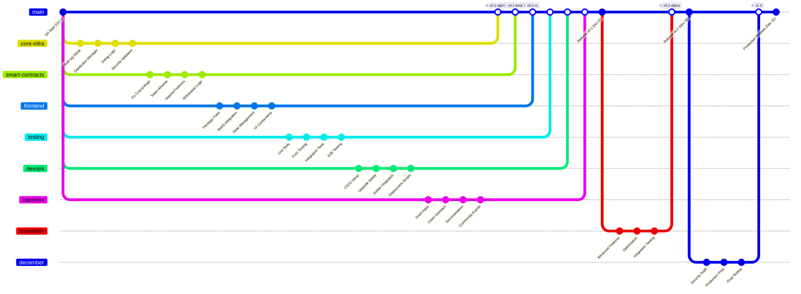
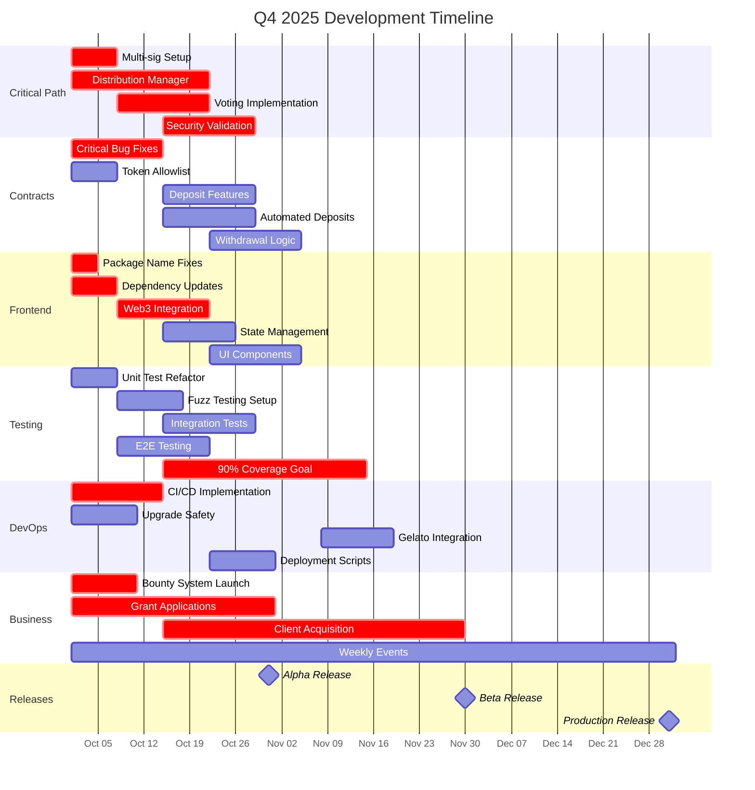

# Q4 2025 Development Plan - Parallel Execution Strategy

## Development Tracks

Based on the dependency analysis, we can execute development in 6 parallel tracks:

### Track 1: Core Infrastructure (Critical Path)
- Distribution Manager & Voting System implementation
- Security hardening and validation
- Multi-sig setup

### Track 2: Smart Contract Development
- Solidarity Fund (crowdstake.fun/breadchain)
- Safety Net (breadfunds)
- Stacks (saving-circles)

### Track 3: Frontend Development
- Web3 integration
- State management
- UI/UX improvements

### Track 4: Testing & Quality
- Unit tests refactoring
- Fuzz testing implementation
- E2E testing setup

### Track 5: DevOps & Automation
- CI/CD pipeline setup
- Gelato/Chainlink automation
- Deployment scripts

### Track 6: Business & Community
- Gas Killer client acquisition
- Grant applications
- Community events
- Documentation

## Mermaid Gitgraph - Parallel Development Flow

## Gantt Chart - Q4 2025 Timeline

## Parallel Execution Matrix

| Week | Track 1 (Core) | Track 2 (Contracts) | Track 3 (Frontend) | Track 4 (Testing) | Track 5 (DevOps) | Track 6 (Business) |
|------|---------------|-------------------|-------------------|------------------|-----------------|-------------------|
| Oct 1-7 | Multi-sig, Distribution Manager | Critical bugs, Token allowlist | Package fixes, Dependencies | Unit tests | CI/CD setup | Bounty launch, Grants |
| Oct 8-14 | Voting logic | Input validation | Web3 integration | Fuzz testing, E2E | Upgrade safety | Grant apps |
| Oct 15-21 | Security validation | Deposit features | State management | Integration tests | Deployment | Client outreach |
| Oct 22-28 | Testing | Withdrawal logic | UI components | Coverage push | Monitoring | Client meetings |
| Oct 29-Nov 4 | Release prep | Integration | Polish | Final tests | Release pipeline | Marketing |
| Nov 5-11 | Advanced voting | Risk formulas | Dashboard | Performance tests | Optimization | User onboarding |
| Nov 12-18 | Optimizations | Gelato integration | Mobile support | Security tests | Automation | Partnerships |
| Nov 19-25 | Feature freeze | Final fixes | UX improvements | Regression tests | Load testing | Documentation |
| Nov 26-Dec 2 | Beta release | Audit prep | Beta feedback | Audit support | Infrastructure | Community growth |
| Dec 3-9 | Security fixes | Documentation | Help system | Final coverage | Monitoring | Training |
| Dec 10-16 | Final testing | Production prep | Launch prep | Smoke tests | Backup systems | Launch planning |
| Dec 17-23 | Code freeze | Deployment | Go-live support | Verification | Operations | Launch events |
| Dec 24-31 | Production | Monitoring | Support | Validation | Maintenance | Celebration |

## Resource Allocation

### Development Teams (Parallel)
1. **Core Team** (3 devs): Distribution Manager, Voting System
2. **Smart Contract Team** (4 devs): All contract development
3. **Frontend Team** (3 devs): UI/UX and Web3 integration
4. **QA Team** (2 devs): Testing and quality assurance
5. **DevOps Team** (2 devs): Infrastructure and automation
6. **Business Team** (3 people): Ron + 2 for grants, clients, community

### Bounty Allocation ($750/month = $2,250 total)
- October: $750 (Critical bugs, testing)
- November: $750 (Features, optimization)
- December: $750 (Documentation, audit support)

## Critical Dependencies to Watch

1. **Distribution Manager** blocks voting features
2. **Multi-sig setup** blocks production deployment
3. **Web3 integration** blocks all frontend features
4. **CI/CD** blocks automated testing and deployment
5. **90% test coverage** blocks security audit
6. **Security audit** blocks production release

## Risk Mitigation

- **Parallel tracks** ensure no single point of failure
- **Weekly syncs** to identify and resolve blockers
- **Bounty system** provides surge capacity
- **Multiple release candidates** allow for iterative improvements
- **Community engagement** provides early feedback

## Success Metrics

- **October**: Core infrastructure complete, critical bugs fixed
- **November**: Beta release with 90% test coverage
- **December**: Production release with security audit complete