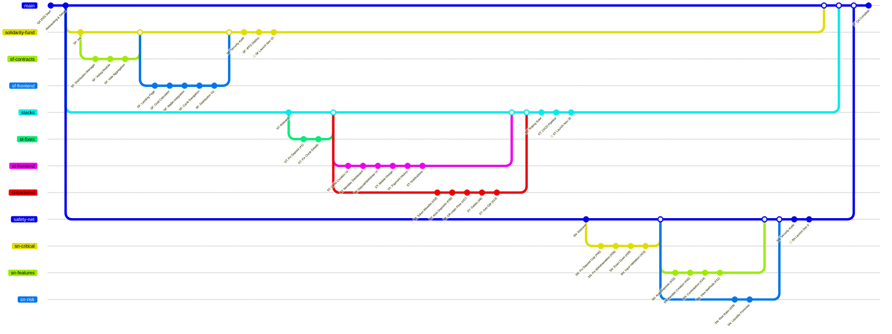
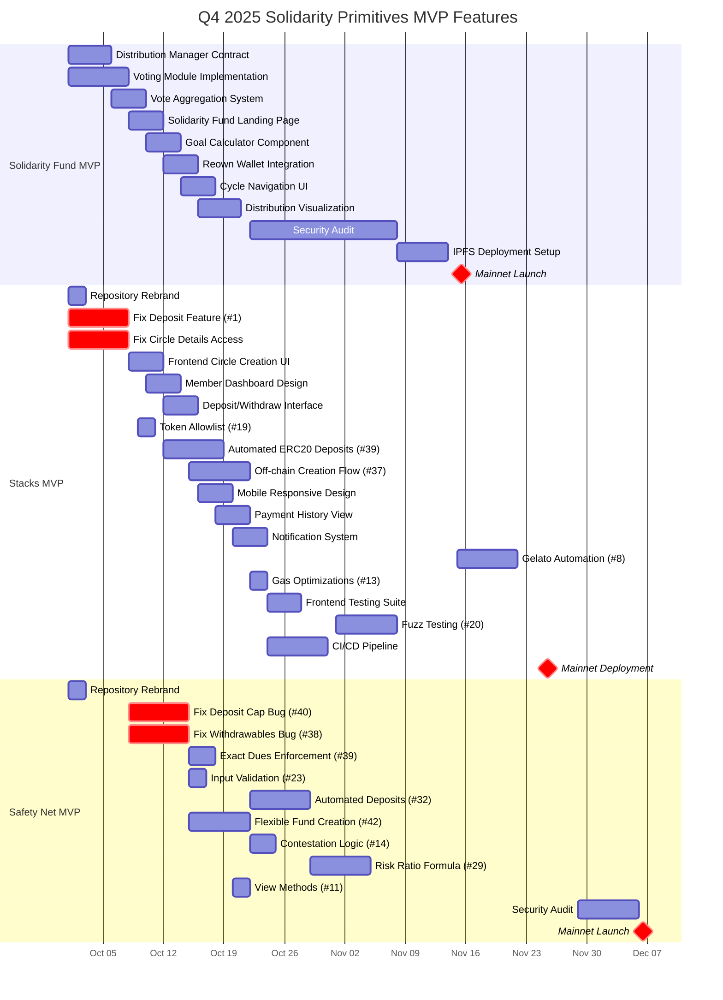
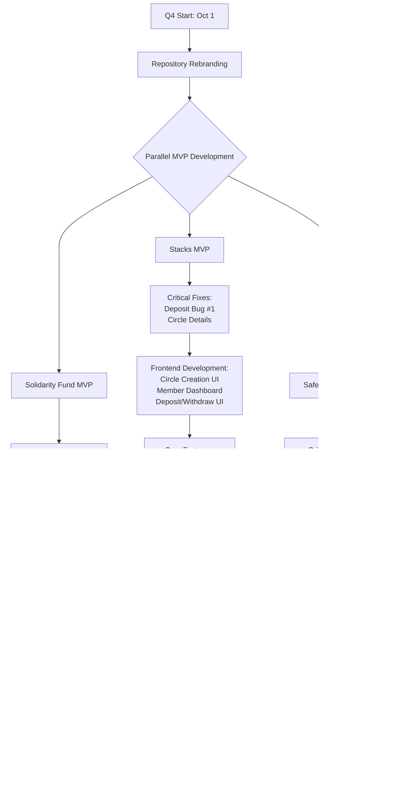

# Q4 2025 Solidarity Primitives MVP Development GitGraph

## Overview
This gitgraph shows the actual MVP feature development for three Solidarity Primitives during Q4 2025, with specific deliverables and scope for each primitive.

## Q4 2025 MVP Feature Development - Parallelized

## Detailed MVP Feature Timeline

## MVP Feature Dependencies

