# Q4 2025 Solidarity Fund Development Timeline

## Overview
This timeline maps all 80+ issues across Q4 2025 (January - March), organized by parallel development tracks to maximize efficiency.

## Timeline Visualization

```mermaid
gantt
    title Solidarity Fund Q4 2025 Development Timeline
    dateFormat YYYY-MM-DD
    axisFormat %b %d

    section Infrastructure
    CI/CD Infrastructure           :active, infra1, 2025-01-02, 5d
    CI/CD Auto-deploy              :infra2, 2025-01-06, 5d
    Upgrade Safety Check           :infra3, 2025-01-06, 5d
    Update Foundry Template        :infra4, after infra2, 3d
    No Security Scanning           :infra5, after infra4, 4d
    No Gas Benchmarking           :infra6, after infra5, 2d
    No Bundle Analysis            :infra7, after infra6, 2d
    No Performance Monitoring     :infra8, after infra7, 3d
    IPFS Deployment              :infra9, after infra8, 4d
    ENS Integration              :infra10, after infra9, 3d
    Arweave Backup               :infra11, after infra9, 3d
    Multi-Gateway Deploy         :infra12, after infra10, 4d

    section Core Contracts
    Core Distribution System      :crit, core1, 2025-01-06, 12d
    Voting Module Implementation  :crit, core2, 2025-01-06, 12d
    Distribution Module          :core3, 2025-01-13, 8d
    Missing Distribution Manager :core4, 2025-01-13, 12d
    Incomplete Voting System     :core5, 2025-01-13, 12d
    No Vote Aggregation         :core6, 2025-01-17, 8d
    Voting functions enhancement :core7, after core2, 5d
    TimeWeightedVotingPower     :core8, after core2, 8d
    Identifier emission         :core9, 2025-01-20, 2d
    Store required votes        :core10, 2025-01-22, 2d
    Refactor QueueProcessed     :core11, 2025-01-24, 1d
    Distribution Strategy       :core12, after core3, 8d
    Voting Module (crowdstake)  :core13, 2025-01-13, 12d
    Coupling addresses          :core14, 2025-01-27, 4d
    Factory Pattern refactor    :core15, 2025-02-03, 12d
    Namespaced storage         :core16, 2025-02-10, 12d
    Variable Delegations       :core17, 2025-02-10, 8d

    section Security
    Security Hardening          :crit, sec1, 2025-01-13, 8d
    Fuzz Testing               :sec2, 2025-01-20, 4d
    Mixed Solidity Versions    :sec3, 2025-01-20, 2d
    Missing Reentrancy Guards  :sec4, 2025-01-20, 4d
    No Emergency Pause         :sec5, 2025-01-20, 4d
    Insufficient Validation    :sec6, 2025-01-20, 2d
    Validate yield amount      :sec7, 2025-01-22, 2d
    Timelock for upgrades      :sec8, 2025-01-24, 8d
    No Multi-sig Setup         :sec9, 2025-01-24, 4d
    Missing Fuzz Testing       :sec10, 2025-01-24, 4d
    Low Test Coverage          :sec11, 2025-01-24, 8d
    Testing refactor           :sec12, 2025-01-24, 8d
    Test Upgrade Simulation    :sec13, 2025-01-31, 4d
    Limited Tests              :sec14, 2025-01-31, 4d
    Security Audit             :crit, sec15, 2025-03-03, 12d

    section Frontend
    Frontend Rebrand           :active, front1, 2025-01-02, 5d
    React 19 Fix              :front2, 2025-01-06, 2d
    Mixed Dependencies Fix     :front3, 2025-01-06, 2d
    No Web3 Integration       :front4, 2025-01-06, 4d
    No State Management       :front5, 2025-01-08, 2d
    No Error Boundaries       :front6, 2025-01-08, 2d
    No CSP Headers           :front7, 2025-01-10, 1d
    No Input Validation      :front8, 2025-01-10, 3d
    Design Variables List    :front9, 2025-01-13, 2d
    E2E Testing             :front10, 2025-01-27, 8d

    section Automation
    Refactor automation system    :auto1, 2025-01-20, 8d
    Broken Automation Architecture :auto2, 2025-01-27, 8d
    Gelato Automation             :auto3, 2025-01-27, 4d
    Chainlink Automation          :auto4, 2025-01-27, 4d
    Gelato Automation (breadchain) :auto5, 2025-01-31, 4d

    section Optimization
    Refactor Unit Tests       :opt1, 2025-01-17, 3d
    Optimize Queue Lookup     :opt2, 2025-02-03, 8d
    Voting Boost - Transactions :opt3, 2025-01-31, 4d
    Boost - Never Burning      :opt4, 2025-01-31, 3d
    Boost - Baking Minimum     :opt5, 2025-01-31, 3d
    POAP Boost                :opt6, 2025-02-03, 4d
    TBS NFT Boost             :opt7, 2025-02-03, 2d
    NFT awarding module       :opt8, 2025-02-14, 5d

    section Releases
    Rename repository         :done, rel1, 2025-01-02, 1d
    Wrong Package Name        :done, rel2, 2025-01-02, 1d
    Version Inconsistency     :rel3, 2025-01-22, 1d
    Release 0.0.1            :rel4, 2025-01-27, 2d
    Release v1.0.4           :rel5, 2025-02-10, 2d
    Release 0.0.2            :rel6, 2025-02-17, 2d
    Release v1.0.5           :rel7, 2025-02-24, 2d
    Documentation Scope      :rel8, 2025-02-21, 5d
    User Documentation       :rel9, 2025-02-26, 5d

    section Production
    Production Deployment     :crit, prod1, 2025-03-17, 3d
    Launch Frontend          :prod2, 2025-03-20, 1d
    Monitoring Setup         :prod3, 2025-03-20, 1d
```

## Parallel Development Tracks

### Track 1: Infrastructure (DevOps Team)
- **Week 1-2**: Setup CI/CD, automated testing, deployment pipelines
- **Week 3-4**: Security scanning, performance monitoring, bundle analysis
- **Week 4-6**: IPFS deployment, ENS integration, multi-gateway setup
- **Continuous**: Maintaining and improving infrastructure

### Track 2: Core Smart Contracts (Blockchain Team)
- **Week 1-3**: Core distribution and voting systems
- **Week 3-5**: Distribution strategies, vote aggregation
- **Week 5-8**: Factory pattern refactoring, namespaced storage
- **Week 8-10**: Integration and optimization

### Track 3: Security (Security Team)
- **Week 2-3**: Initial hardening (reentrancy, pause, validation)
- **Week 3-4**: Fuzz testing, test coverage improvements
- **Week 4-5**: Timelock, multi-sig setup
- **Week 10-12**: Final security audit

### Track 4: Frontend (Frontend Team)
- **Week 1**: Rebrand and dependency fixes
- **Week 1-2**: Web3 integration, state management
- **Week 2-3**: Error handling, validation
- **Week 4-6**: E2E testing and optimization

### Track 5: Automation & Optimization (Integration Team)
- **Week 3-4**: Refactor automation system
- **Week 4-5**: Gelato and Chainlink integration
- **Week 5-7**: Queue optimization, voting boosts
- **Week 7-8**: NFT modules and rewards

## Critical Path

The critical path for Q4 2025 production launch:

1. **Infrastructure Setup** (Jan 2-6) ➔
2. **Core Contracts** (Jan 6-17) ➔
3. **Security Hardening** (Jan 13-20) ➔
4. **Integration Testing** (Jan 27 - Feb 3) ➔
5. **Optimization** (Feb 3-17) ➔
6. **Release Candidates** (Feb 17-26) ➔
7. **Security Audit** (Mar 3-14) ➔
8. **Production Deploy** (Mar 17-21)

## Milestones

### January Milestones
- ✅ Week 1: Infrastructure and frontend foundations
- ✅ Week 2-3: Core contract implementations
- ✅ Week 3-4: Security measures and testing
- ✅ Week 4: First release candidate (0.0.1)

### February Milestones
- ✅ Week 1-2: Optimization and enhancements
- ✅ Week 2-3: Advanced features (boosts, NFTs)
- ✅ Week 3-4: Documentation and v1.0.4 release
- ✅ Week 4: Feature complete for audit

### March Milestones
- ✅ Week 1-2: Security audit
- ✅ Week 2: Audit remediation
- ✅ Week 3: Production deployment
- ✅ Week 3-4: Monitoring and post-launch support

## Resource Allocation

### Recommended Team Structure
- **2 Infrastructure Engineers**: CI/CD, deployment, monitoring
- **3 Smart Contract Developers**: Core contracts, integration
- **2 Security Engineers**: Hardening, testing, audit prep
- **2 Frontend Developers**: UI/UX, Web3 integration
- **1 Integration Engineer**: Automation, optimization
- **1 Technical Writer**: Documentation
- **1 Project Manager**: Coordination, dependencies

## Risk Mitigation

### High-Risk Items (Critical Path)
1. **Core Distribution System** - Start immediately, highest complexity
2. **Security Audit** - Book auditor early, allow buffer time
3. **Production Deployment** - Multi-sig setup, gradual rollout

### Mitigation Strategies
- Parallel development tracks to avoid bottlenecks
- Weekly sync meetings between tracks
- Automated testing to catch issues early
- Feature flags for gradual rollout
- Backup plans for external dependencies (Gelato, Chainlink)

## Success Metrics

### Q4 2025 Targets
- ✅ 100% test coverage achieved
- ✅ Zero critical security findings
- ✅ < 2 second page load time
- ✅ 3+ decentralized hosting gateways
- ✅ Mainnet deployment by March 21
- ✅ $5,000+ TVL within first week
- ✅ 5+ active mutual aid groups onboarded

## Dependencies Matrix

| Track | Depends On | Blocks |
|-------|------------|---------|
| Infrastructure | None | All testing, deployment |
| Core Contracts | Infrastructure | Security, Frontend integration |
| Security | Core Contracts | Audit, Production |
| Frontend | None initially | E2E Testing |
| Automation | Core Contracts | Advanced features |
| Documentation | All features | User onboarding |
| Production | Security Audit | Launch |

## Budget Allocation

### Estimated Costs (Q4 2025)
- Development: 40% of Solidarity Primitives budget
- Security Audit: $50,000-$75,000
- Infrastructure: $5,000/month
- Monitoring: $2,000/month
- Gas for deployment: ~$10,000
- Total: ~$150,000-$200,000

## Conclusion

This comprehensive timeline ensures the Solidarity Fund achieves production readiness by end of Q4 2025 through:
- Parallel development maximizing efficiency
- Clear dependencies and critical path
- Risk mitigation strategies
- Adequate resource allocation
- Measurable success metrics

The plan accommodates all 80+ identified issues while maintaining flexibility for adjustments based on progress and discoveries during development.