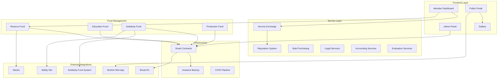
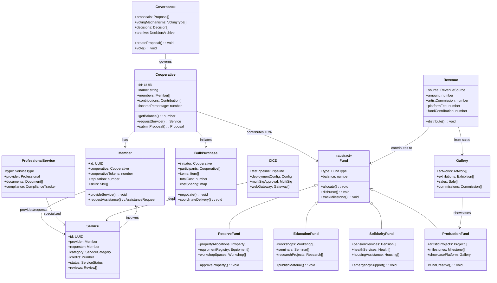
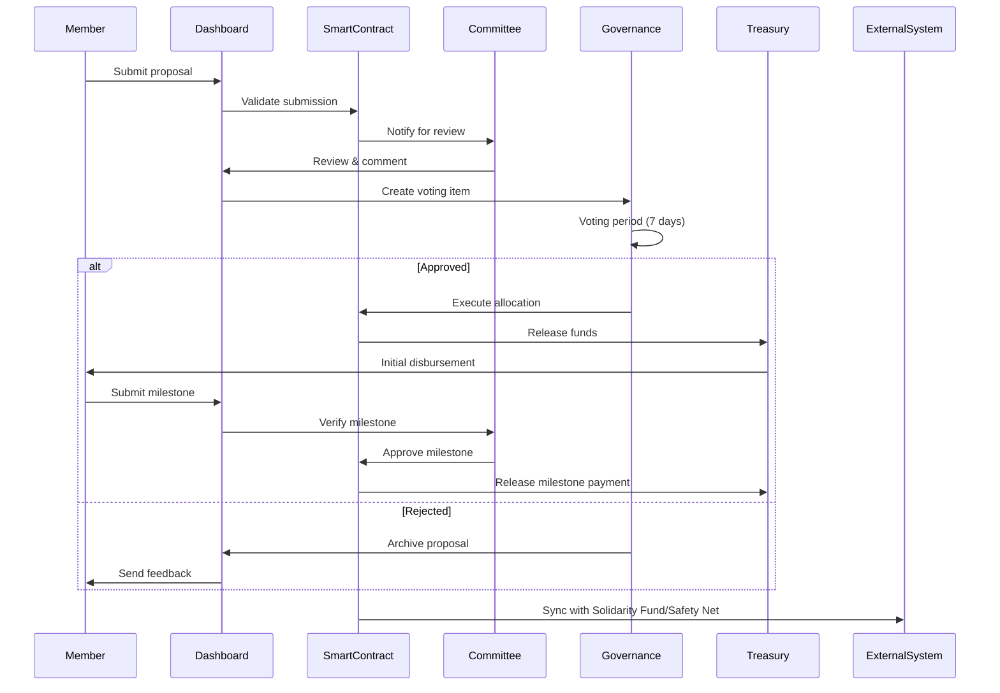
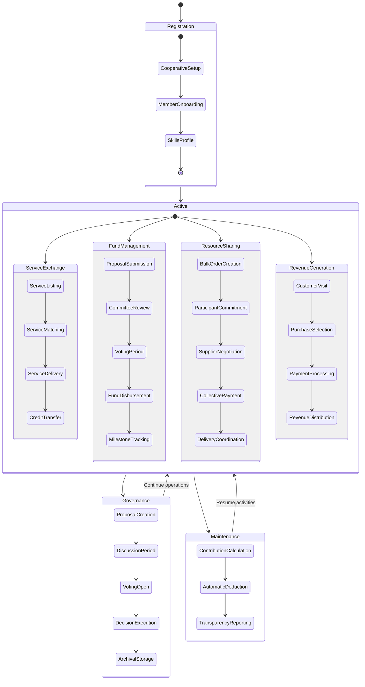
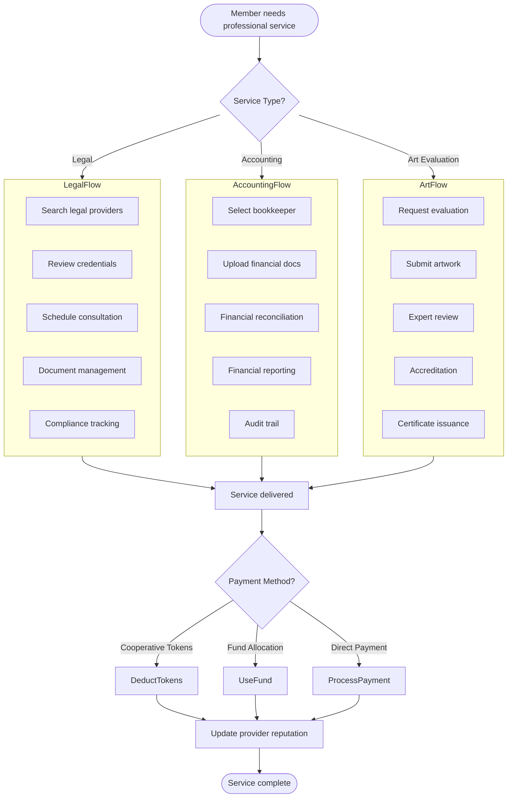
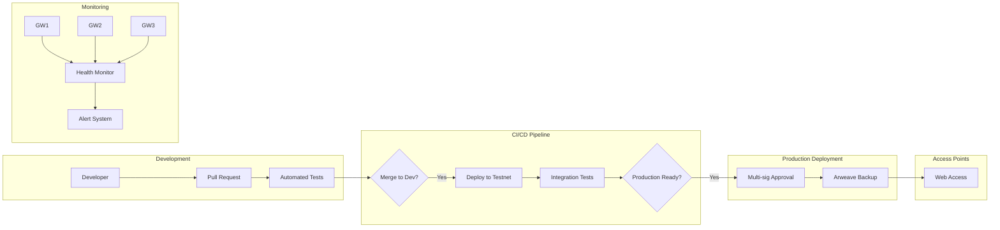
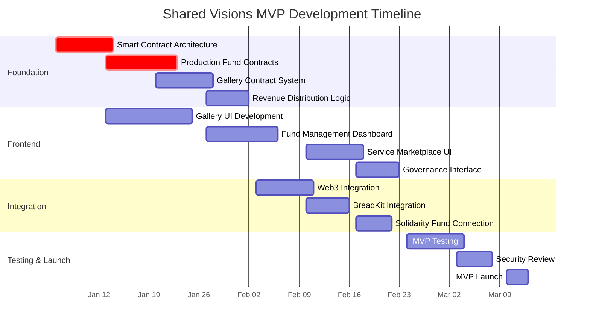

# Shared Visions Platform - Technical Specification

## 1. Background

### Problem Statement
Visual artists cooperatives face significant barriers to sustainable creative practice and economic viability. Artists struggle to access essential resources while cooperatives duplicate efforts in isolation. The Shared Visions platform addresses critical challenges that prevent artistic cooperatives from thriving:

**Creative Production Barriers:**
- Limited access to studio spaces, equipment, and materials for artistic production
- Fragmented funding streams that favor individual competition over collective creation
- Lack of professional evaluation and accreditation services for emerging artists
- No centralized showcase platform for cooperative-produced artworks

**Economic Sustainability Challenges:**
- Artists unable to afford legal, accounting, and grant writing services individually
- Missed opportunities for bulk purchasing of art supplies and equipment
- Revenue concentrated in commercial galleries rather than artist cooperatives
- No mechanism for artists to exchange services using cooperative tokens

**Collective Support Gaps:**
- Absence of mutual aid systems for artists facing health, housing, or financial crises
- Limited access to professional development and educational resources
- No structured mentorship or skill-sharing between experienced and emerging artists
- Isolated cooperatives unable to leverage collective bargaining power

### Context / History
- The Bread Cooperative has grown to include multiple member cooperatives operating independently
- Previous attempts at coordination relied on manual processes and ad-hoc agreements
- Existing Solidarity Primitives (Solidarity Fund, Safety Net) provide partial solutions but lack comprehensive integration
- Q4 2025 target established for platform launch as part of Priority 3 expansion

### Stakeholders
- **Primary Users**: Member cooperatives and their constituents
- **Fund Participants**: Contributors to Reserve, Education, Solidarity, and Production funds
- **Service Providers**: Legal, accounting, artistic evaluation professionals
- **External Systems**: Solidarity Fund, Stacks, Safety Net, Ibrahim Mini App, Bread Kit
- **Governance Bodies**: Cooperative councils, fund allocation committees

## 2. Motivation

### Goals & Success Stories

**User Goals:**
- Member cooperatives can share resources and reduce operating costs by 20%
- Artists can access funding through multiple cooperative funds
- Service providers can offer expertise to multiple cooperatives efficiently
- Constituents can participate in token-based mutual aid systems
- Governance participants can make informed decisions with transparent data

**Technical Functionality:**
- Automated fund allocation and disbursement system
- Real-time service matching and exchange platform
- Decentralized governance infrastructure
- Integrated resource management and tracking

### Non-Goals

| Technical Functionality | Reasoning for being off scope | Tradeoffs |
|------------------------|-------------------------------|-----------|
| Physical asset management | Requires IoT integration | Manual check-in/out for equipment |
| Cross-chain interoperability | Technical complexity for v1 | Single chain deployment initially |
| AI-powered service matching | Computational overhead | Rule-based matching sufficient for MVP |

### Value Proposition

| Technical Functionality | Value | Tradeoffs |
|------------------------|-------|------------|
| Smart contract fund management | Automated, trustless allocation | Gas costs for operations |

### Alternative Approaches

| Technical Functionality | Pros | Cons |
|------------------------|------|------|
| Centralized database | Lower costs, faster queries | Single point of failure, trust required |
| Federation model | Balance of decentralization/efficiency | Complex synchronization |
| Pure blockchain | Full decentralization | High costs, slower performance |

## 3. Scope and Approaches

### In Scope
- Four fund types (Reserve, Education, Solidarity, Production)
- Service exchange marketplace with token-based payments
- Bulk purchasing coordination
- Governance tools and voting mechanisms
- Integration with existing Solidarity Primitives

### Out of Scope
- Physical asset tracking beyond basic registry
- Cross-chain bridging in v1
- Automated legal document generation
- Time banking system (will be facilitated through Bread-like token using Solidarity Fund/BreadKit/crowdstake.fun code offchain P2P)

## 4. Step-by-Step Flow

### 4.1 Main Flows

#### Service Exchange Flow
**Pre-condition**: Member cooperatives registered with cooperative tokens

1. **Service Provider** lists service in catalog with credit pricing
2. **System** validates credentials and adds to marketplace
3. **Service Requester** searches catalog by category/skills
4. **System** shows matched services with reputation scores
5. **Requester** initiates service request
6. **System** checks credit balance and locks escrow
7. **Provider** accepts request and delivers service
8. **Both Parties** confirm completion
9. **System** transfers credits and updates reputation

**Post-condition**: Credits transferred, reputation updated, service logged

#### Reserve Fund Allocation Flow
**Pre-condition**: Cooperative needs funding for equipment/property

1. **Cooperative** submits property/equipment proposal
2. **System** validates proposal completeness
3. **Governance** reviews proposal in dashboard
4. **Members** vote during voting period
5. **System** tallies votes and checks quorum
6. **Smart Contract** executes approved allocation
7. **Treasury** disburses funds to cooperative
8. **Cooperative** reports usage and outcomes

**Post-condition**: Funds allocated, tracking initiated

#### Education Fund Distribution Flow
**Pre-condition**: Educational project requires funding

1. **Educator** submits workshop/seminar/research proposal
2. **System** categorizes by education type
3. **Education Committee** reviews proposal
4. **System** creates funding milestones
5. **Approval** triggers initial disbursement
6. **Educator** submits progress reports
7. **System** releases milestone payments
8. **Platform** publishes educational materials

**Post-condition**: Education delivered, materials archived

#### Solidarity Fund Support Flow
**Pre-condition**: Member needs wellbeing assistance

1. **Member** submits assistance request (health/housing/food)
2. **System** validates member standing
3. **Solidarity Committee** reviews urgency
4. **System** connects to relevant services
5. **Fund** disburses emergency assistance
6. **Member** receives support services
7. **System** tracks outcome metrics

**Post-condition**: Support provided, metrics recorded

#### Production Fund Project Flow
**Pre-condition**: Artistic project needs funding

1. **Artist** submits creative project proposal
2. **System** evaluates project scope
3. **Production Committee** reviews artistic merit
4. **System** sets milestone schedule
5. **Fund** releases initial funding
6. **Artist** submits progress updates
7. **Platform** showcases work-in-progress
8. **Completion** triggers final payment
9. **Gallery** features completed work

**Post-condition**: Project completed, work showcased

#### Bulk Purchasing Flow
**Pre-condition**: Multiple cooperatives need supplies

1. **Initiator** creates bulk order proposal
2. **System** calculates volume discounts
3. **Cooperatives** commit to purchase quantities
4. **System** aggregates orders
5. **Platform** negotiates with suppliers
6. **Cooperatives** approve final pricing
7. **System** processes collective payment
8. **Logistics** coordinates delivery
9. **Members** confirm receipt

**Post-condition**: Supplies delivered, costs shared

#### Revenue Generation Flow
**Pre-condition**: Platform generates income

1. **Customer** visits public portal
2. **System** displays gallery/services
3. **Customer** selects artwork/service/donation
4. **Platform** processes payment
5. **System** allocates revenue:
   - Artist commission
   - Platform fee (10%)
   - Fund contributions
6. **Dashboard** updates financial metrics
7. **Cooperative** receives payment

**Post-condition**: Revenue distributed, metrics updated

#### Legal Services Flow
**Pre-condition**: Member needs legal assistance

1. **Member** searches legal service providers
2. **Platform** displays available lawyers/legal aid
3. **Member** reviews credentials and specializations
4. **System** schedules consultation
5. **Legal Provider** uploads documents to secure vault
6. **Platform** tracks compliance requirements
7. **Service** completion triggers payment
8. **System** maintains audit trail

**Post-condition**: Legal service delivered, documents archived

#### Accounting Services Flow
**Pre-condition**: Cooperative needs bookkeeping services

1. **Cooperative** requests accounting service
2. **System** matches with qualified bookkeepers
3. **Bookkeeper** accesses financial documents
4. **Platform** processes transactions
5. **System** generates financial reports
6. **Bookkeeper** prepares financial documents
7. **Platform** ensures compliance
8. **Cooperative** approves and pays

**Post-condition**: Books reconciled, reports generated

#### Art Evaluation Services Flow
**Pre-condition**: Artist needs work evaluation/accreditation

1. **Artist** submits artwork for evaluation
2. **System** assigns qualified evaluators
3. **Evaluator** reviews submission
4. **Platform** facilitates expert panel if needed
5. **System** generates evaluation report
6. **Platform** issues accreditation certificate
7. **Gallery** updates artist credentials
8. **Artist** receives certification

**Post-condition**: Artwork evaluated, accreditation issued

#### Grant Writing Services Flow
**Pre-condition**: Cooperative needs grant application support

1. **Cooperative** identifies grant opportunity
2. **Platform** assigns grant writer
3. **Writer** collaborates on proposal
4. **System** tracks deadlines
5. **Platform** manages document versions
6. **Writer** submits application
7. **System** monitors application status
8. **Platform** reports outcomes

**Post-condition**: Grant submitted, outcome tracked

#### Operating Cost Management Flow
**Pre-condition**: Platform tracks operational expenses

1. **System** monitors personnel costs
2. **Platform** tracks time allocations
3. **Algorithm** calculates cost distribution
4. **System** integrates payroll data
5. **Platform** generates cost reports
6. **Dashboard** displays metrics
7. **Governance** reviews efficiency
8. **System** suggests optimizations

**Post-condition**: Costs tracked, efficiencies identified

### 4.2 Alternate / Error Paths

| # | Condition | System Action | Suggested Handling |
|---|-----------|---------------|-------------------|
| A1 | Service dispute | Lock credits, flag for review | Governance committee resolution |
| A2 | Insufficient credits | Reject transaction | Offer credit earning opportunities |
| A3 | Provider unavailable | Return to search | Suggest alternative providers |
| A4 | Smart contract failure | Log error, rollback | Manual intervention notification |
| A5 | Fund proposal rejected | Archive proposal | Provide feedback for revision |
| A6 | Milestone not met | Pause disbursement | Request updated timeline |
| A7 | Bulk order minimum not met | Cancel order | Extend commitment period |
| A8 | Emergency assistance urgent | Fast-track approval | Direct committee notification |
| A9 | Artwork evaluation dispute | Third-party review | Expert panel consultation |
| A10 | Contribution calculation error | Manual override | Audit trail creation |

## 5. UML Diagrams

### Component Architecture Diagram

### Class Diagram - Complete Entity Model

### Sequence Diagram - Complete Fund Allocation Process

### State Diagram - Complete Platform States

### Activity Diagram - Service Infrastructure Workflow

### Deployment Architecture Diagram

## 6. Edge Cases and Concessions

### Edge Cases Not Fully Accounted For
- **Cooperative Exit**: Manual intervention required for fund redistribution
- **Service Quality Disputes**: Relies on governance rather than automated resolution
- **Cross-Cooperative Projects**: Limited to bilateral agreements initially

### Design Decisions and Compromises
- **10% Contribution**: Fixed percentage rather than progressive scale
- **Reputation System**: Simple scoring vs. complex trust network
- **Fund Categories**: Four fixed types vs. dynamic fund creation
- **Service Matching**: Geographic proximity not considered in v1

## 7. Open Questions

1. **Regulatory Compliance**: How to handle KYC/AML requirements for larger transactions?
2. **Token Economics**: Should platform have native token or use existing?
3. **Dispute Resolution**: What percentage of disputes require human intervention?
4. **Scalability**: At what member count does current architecture need revision?
5. **Integration Priority**: Which external systems to integrate first?
6. **Governance Quorum**: What participation level required for valid decisions?

## 8. MVP Scope and Timeline

### MVP Feature Set (Q4 2025)

Based on the Strategic Directives Priority 2 (Brand Growth) and Priority 3 (Solidarity Primitives Expansion), the Shared Visions MVP will focus on essential features for visual artist cooperatives:

**Core MVP Features:**
1. **Artist Cooperative Gallery** - Showcase platform for cooperative-produced artworks
2. **Production Fund Management** - Basic funding allocation for artistic projects
3. **Service Exchange Marketplace** - Artists can offer/request professional services
4. **Revenue Distribution System** - Automatic allocation of sales revenue to artists and funds
5. **Basic Governance Tools** - Proposal submission and voting for fund allocation

**MVP Timeline (January - March 2025)**

### Development Phases

**Phase 1: Foundation (Jan 6-27)**
- Smart contract architecture for funds and governance
- Production Fund core functionality
- Gallery storage and display system
- Revenue distribution mechanism

**Phase 2: User Interface (Jan 13 - Feb 23)**
- Gallery frontend for artwork display
- Fund management dashboard for artists and cooperatives
- Service marketplace for professional services
- Basic governance voting interface

**Phase 3: Integration (Feb 3-22)**
- Web3 wallet integration
- BreadKit smart contract integration
- Connection to existing Solidarity Fund system
- Cooperative token integration

**Phase 4: Launch Preparation (Feb 24 - Mar 13)**
- Comprehensive testing of all MVP features
- Security review of smart contracts
- Documentation and user guides
- MVP launch with initial artist cooperatives

### Success Metrics for MVP

**Priority 2 Alignment (Brand Growth):**
- Gallery showcases 20+ artworks from cooperative artists
- 3+ artist cooperatives onboarded to platform
- Revenue generation through art sales demonstrating viability

**Priority 3 Alignment (Solidarity Primitives):**
- Production Fund successfully allocates funding to 5+ artistic projects
- Service marketplace facilitates 10+ professional service exchanges
- Integration with existing Bread Cooperative token ecosystem

### Resource Requirements

**Development Team:**
- 1 Smart Contract Developer (full-time, 8 weeks)
- 1 Frontend Developer (full-time, 6 weeks)
- 0.5 Integration Engineer (part-time, 4 weeks)
- 0.25 Security Reviewer (consultation, 1 week)

**Budget Allocation:**
- Development: $15,000 (from Priority 2: 50% budget allocation)
- Testing & Security: $3,000
- Infrastructure: $1,000
- Total MVP Budget: $19,000

### Risk Mitigation

**Technical Risks:**
- Smart contract integration delays → Use proven BreadKit templates
- Frontend complexity → Focus on core gallery functionality first
- Token integration issues → Leverage existing Solidarity Fund patterns

**Strategic Risks:**
- Artist cooperative adoption → Partner with existing cooperatives early
- Revenue model validation → Start with simple commission structure
- Market timing → Align with broader Bread Cooperative rebrand launch

## 9. Glossary / References

**Terms:**
- **Solidarity Economy**: Economic system based on cooperation and mutual aid
- **Multi-sig**: Multi-signature wallet requiring multiple approvals

**References:**
- [Bread Cooperative Documentation](https://docs.bread.coop)
- [Solidarity Primitives Overview](/solidarity-primitives)
- [Quartz Framework Documentation](https://quartz.jzhao.xyz)
- [Smart Contract Best Practices](https://consensys.github.io/smart-contract-best-practices/)
- [Cooperative Principles](https://www.ica.coop/en/cooperatives/cooperative-identity)

**Internal Documentation:**
- Solidarity Fund Integration Guide
- Safety Net API Documentation
- Bread Kit Contract Templates
- Ibrahim Mini App Interface Specifications