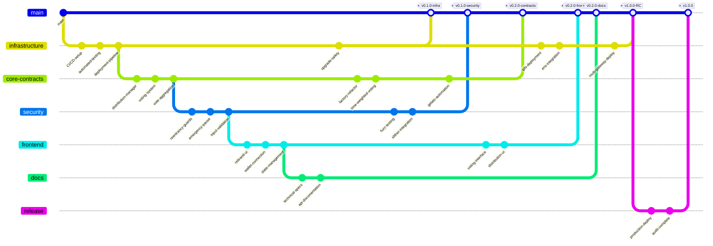

# Solidarity Fund Development Plan

## Introduction

The Solidarity Fund is the core infrastructure for Bread Cooperative's solidarity economy applications. This development plan organizes the Q4 2025 action items into a parallelized development strategy that maximizes team efficiency while maintaining code quality and security standards.

## Development Strategy

### Parallel Development Tracks

The development is organized into five parallel tracks that can be worked on simultaneously by different team members:

1. **Core Smart Contract Track** - Distribution & voting implementation
2. **Infrastructure Track** - CI/CD, deployment, and automation
3. **Security Track** - Testing, auditing, and hardening
4. **Frontend Track** - UI rebrand and feature implementation
5. **Documentation Track** - Technical docs and specifications

## Git Branch Strategy

## Dependency Analysis

### Critical Path Dependencies

1. **Infrastructure must complete first** to enable automated testing for all other tracks
2. **Core contracts** depend on infrastructure for testing but can develop in parallel
3. **Security track** can begin immediately with existing code
4. **Frontend** can mock smart contracts initially, then integrate
5. **Documentation** runs parallel throughout entire development

### Parallelization Opportunities

- **Maximum parallel teams**: 5
- **Minimum critical path**: Infrastructure → Core Contracts → Security Audit → Production
- **Estimated timeline**: 8-10 weeks with full parallelization
