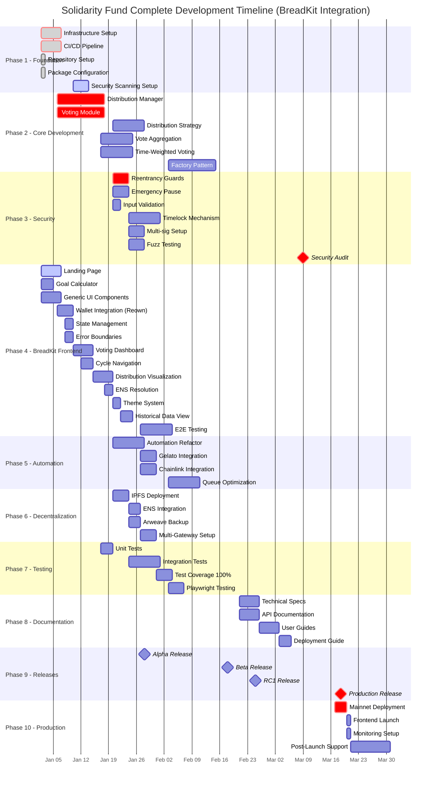
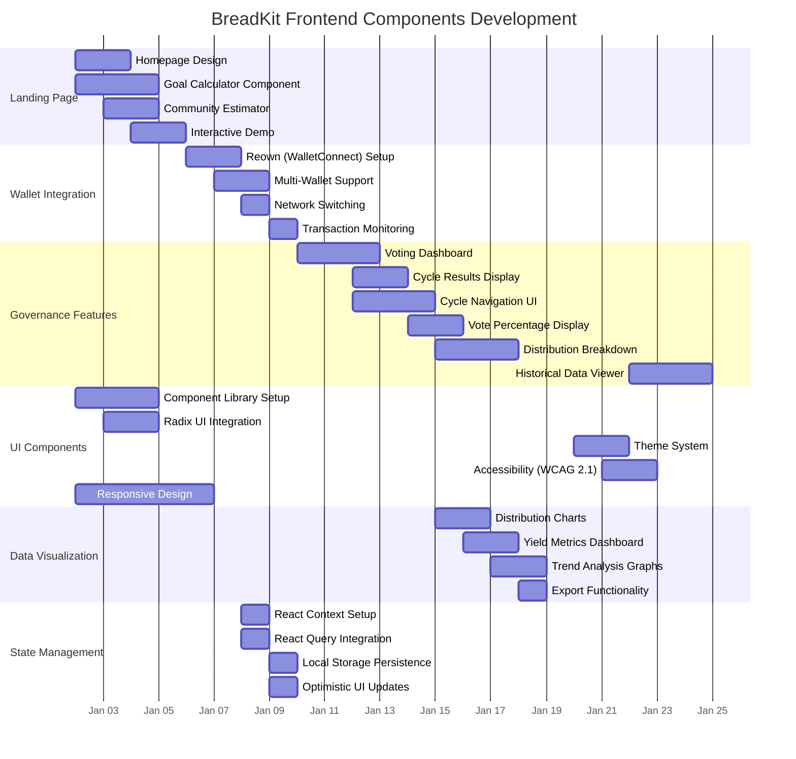
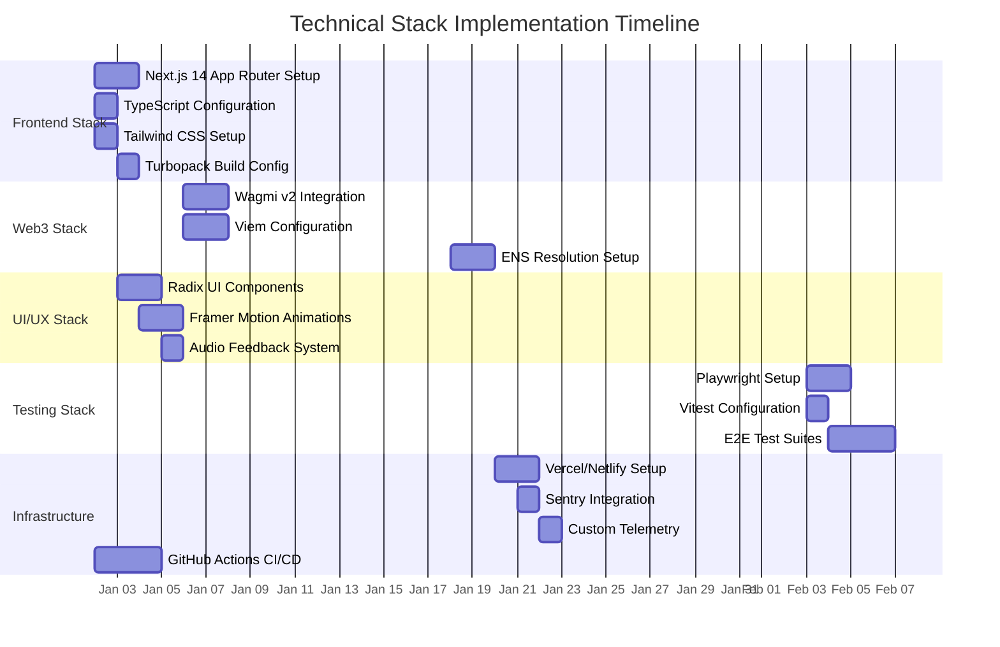
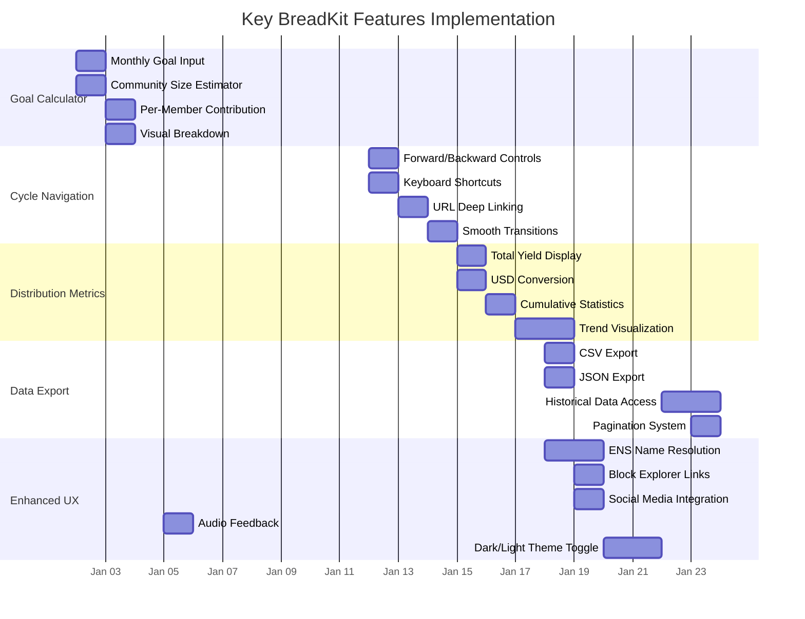
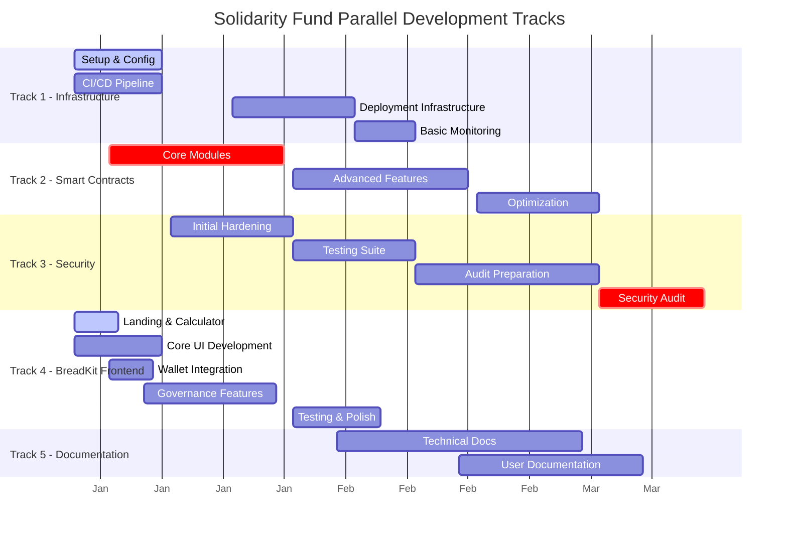

# Solidarity Fund Development Gantt Chart (Updated)

## Complete Development Timeline (Q1 2025)

## BreadKit Frontend Components Timeline

## Technical Stack Implementation

## Key Features Timeline

## Parallel Development Tracks (Updated)

## Summary Statistics (Updated)

- **Total Duration**: 79 days (Jan 2 - Mar 21, 2025)
- **Critical Path Length**: 65 days
- **Parallel Tracks**: 5
- **Major Milestones**: 12
- **Team Size**: 9-10 developers (removed performance monitoring role)
- **High-Risk Items**: 3
- **Buffer Days**: 11 (distributed)

## Key Changes from Original:

1. **Removed Performance Monitoring** as a dedicated phase
2. **Changed "Rebrand UI" to "Generic UI Components"**
3. **Added BreadKit-specific features**:
   - Landing page with goal calculator
   - Community size estimator
   - Monthly goal targeting
   - Per-member contribution calculator
4. **Integrated BreadKit Frontend Spec**:
   - Reown (WalletConnect) for wallet integration
   - Cycle navigation with keyboard shortcuts
   - Distribution visualization and metrics
   - Historical data viewing
   - ENS resolution
   - Theme system (dark/light)
   - Export functionality (CSV/JSON)
5. **Updated Tech Stack** to match BreadKit:
   - Next.js 14 with App Router
   - Wagmi v2 + Viem for Web3
   - Radix UI for components
   - Framer Motion for animations
   - Playwright for E2E testing