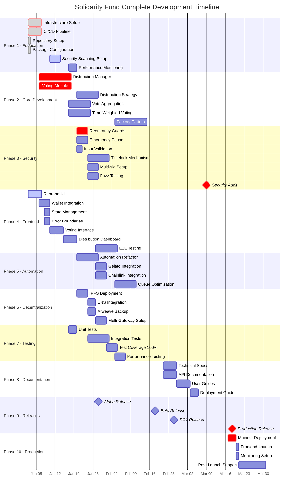
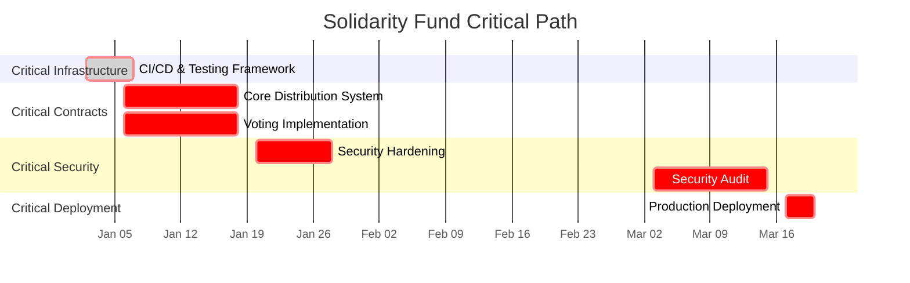
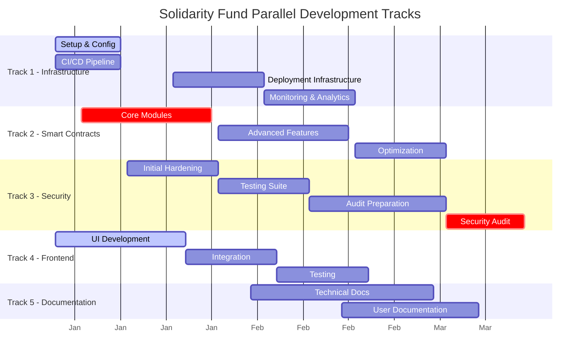
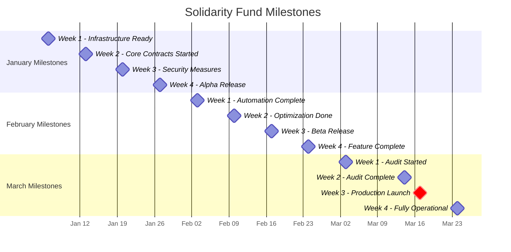
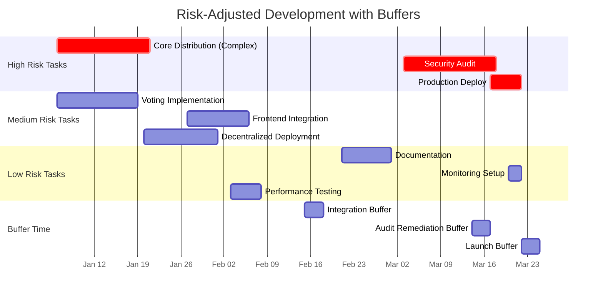
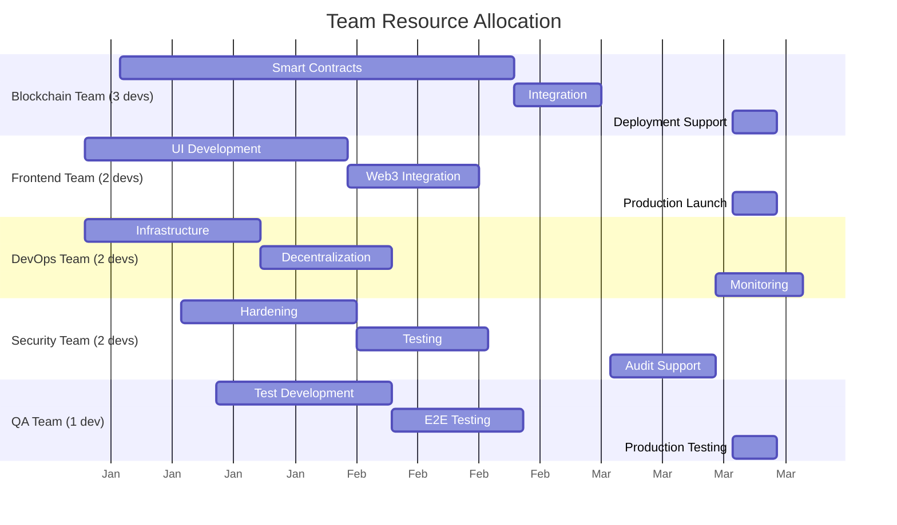
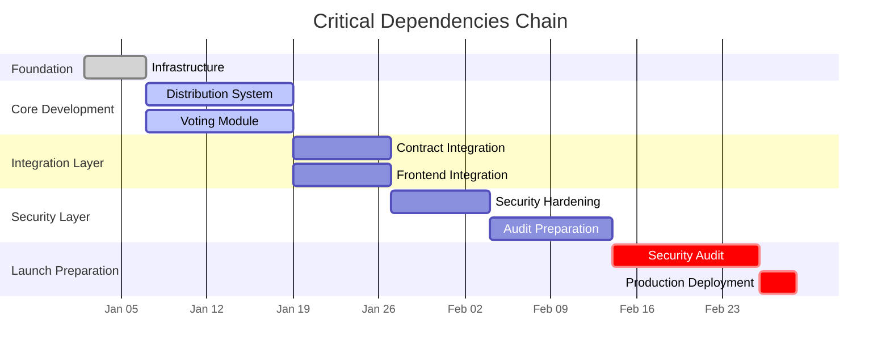

# Solidarity Fund Development Gantt Chart

## Complete Development Timeline (Q1 2025 - Q1 2025)

## Critical Path Breakdown

## Parallel Work Streams

## Milestone-Based View

## Risk-Adjusted Timeline

## Resource Allocation View

## Dependencies Flow

## Summary Statistics

- **Total Duration**: 79 days (Jan 2 - Mar 21, 2025)
- **Critical Path Length**: 65 days
- **Parallel Tracks**: 5
- **Major Milestones**: 12
- **Team Size**: 10-11 developers
- **High-Risk Items**: 3
- **Buffer Days**: 11 (distributed)