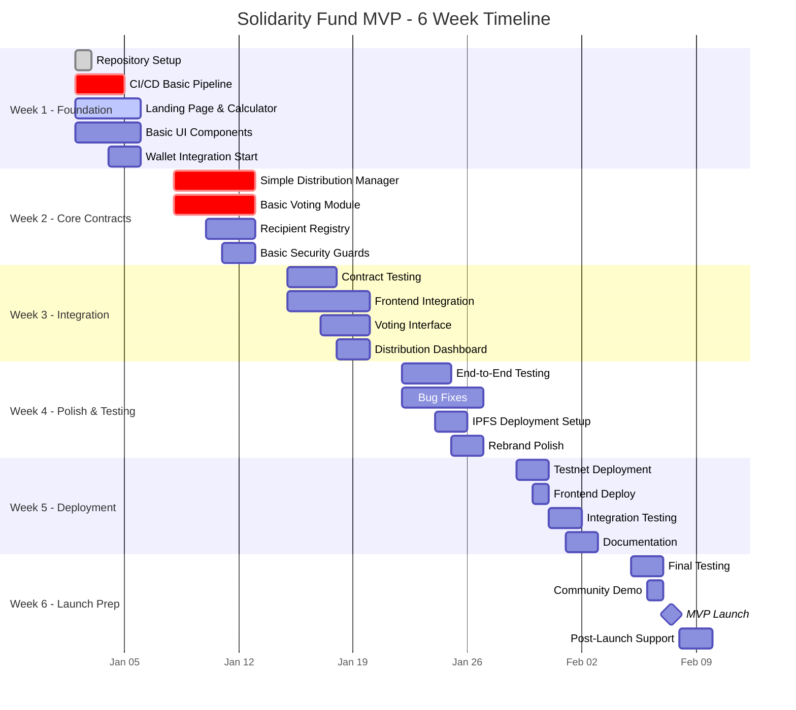
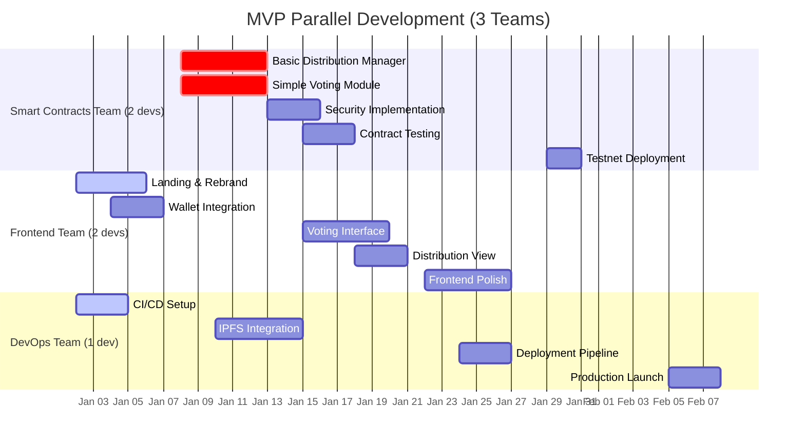

# Solidarity Fund MVP Timeline (Strategic Directives Aligned)

## MVP Scope Definition

Based on Q4 2025 Strategic Directives, the MVP must deliver:

### Strategic Priority 2: Brand Presence (50% budget allocation)
- **Key Requirements**: Solidarity Fund app rebrand completion
- **Success Metric**: Finished Solidarity Fund app rebrand

### Strategic Priority 3: Solidarity Primitives (40% budget allocation)
- **Key Requirements**: BreadKit partial feature parity (excluding BB) with current Solidarity Fund
- **Success Metrics**:
  - BreadKit smart contracts published
  - BreadKit partial feature parity achieved
  - More open source contributors

## MVP Features (Essential Only)

### Core Smart Contracts (Minimum Viable)
1. **Basic Distribution Manager** - Simple yield distribution without complex strategies
2. **Simple Voting Module** - Basic governance for distribution decisions
3. **Recipient Registry** - Manage who can receive distributions
4. **Security Essentials** - Basic reentrancy protection and access controls

### Frontend (BreadKit MVP)
1. **Landing Page** - Goal calculator for community estimation
2. **Wallet Connection** - Reown/WalletConnect integration
3. **Basic Voting Interface** - Vote on distributions
4. **Simple Distribution View** - See distribution results
5. **Rebrand Implementation** - New Bread Cooperative design system

### Infrastructure (Minimum)
1. **Basic CI/CD** - Automated testing and deployment
2. **IPFS Deployment** - Decentralized hosting
3. **Testnet Deployment** - Working testnet version

## MVP Timeline - 6 Weeks (Accelerated)

## Parallel MVP Development Tracks

## Reduced Feature Set vs Full Version

### ❌ Features CUT from MVP:
- **Advanced Security**: Emergency pause, timelock, multi-sig (basic protection only)
- **Complex Voting**: Time-weighted voting, delegation, signature voting
- **Advanced Distribution**: Multiple strategies, complex calculations
- **Automation**: Gelato/Chainlink integration
- **Analytics**: Historical data, export functionality
- **Performance**: Queue optimization, gas optimization
- **Advanced UI**: Cycle navigation, detailed charts
- **Documentation**: Comprehensive docs (basic only)
- **Testing**: Fuzz testing, property testing (unit tests only)

### ✅ Features KEPT in MVP:
- **Core Functionality**: Basic distribution and voting
- **Brand Requirements**: Full rebrand implementation
- **Essential Security**: Reentrancy guards, access control
- **Wallet Integration**: Web3 connection
- **Basic UI**: Calculator, voting, results
- **Deployment**: IPFS hosting, testnet deployment

## Resource Allocation (MVP)

### Team Size: 5 developers (vs 10 in full version)
- **2 Smart Contract Developers**
- **2 Frontend Developers**
- **1 DevOps Engineer**

### Time Allocation
- **Week 1**: Foundation & setup
- **Week 2**: Core development
- **Week 3**: Integration
- **Week 4**: Testing & polish
- **Week 5**: Deployment
- **Week 6**: Launch preparation

## Strategic Alignment Check

### Priority 2: Brand Presence ✅
- **Solidarity Fund rebrand**: Complete UI rebrand with new design system
- **Landing page**: Goal calculator for community engagement
- **Professional appearance**: Clean, accessible interface

### Priority 3: Solidarity Primitives ✅
- **BreadKit contracts published**: Basic distribution and voting contracts
- **Partial feature parity**: Core functionality working (excluding advanced features)
- **Open source**: Repository setup for contributors

## Success Metrics (MVP)

### Technical Metrics
- [ ] Smart contracts deployed to testnet
- [ ] Frontend accessible via IPFS
- [ ] Basic voting functionality working
- [ ] Distribution mechanism functional
- [ ] Wallet connection stable

### Strategic Metrics (Q4 Directives)
- [ ] **Solidarity Fund app rebrand complete** (Priority 2)
- [ ] **BreadKit smart contracts published** (Priority 3)
- [ ] **Partial feature parity achieved** (Priority 3)
- [ ] Positioned for open source contributors

### User Metrics (MVP)
- [ ] Can calculate community funding goals
- [ ] Can connect wallet and vote
- [ ] Can view distribution results
- [ ] 5+ test users successfully complete flow

## Risk Management (MVP Scope)

### High Risk ✅ Mitigated
- **Over-engineering**: Strict feature cuts ensure focus
- **Timeline pressure**: 6 weeks vs 12 weeks reduces pressure
- **Resource constraints**: Smaller team, simpler scope

### Medium Risk ⚠️ Managed
- **Integration complexity**: Simplified architecture reduces risk
- **Security concerns**: Basic protections only, full audit later
- **User experience**: MVP UX, improvements in future versions

### Low Risk ✅ Acceptable
- **Performance**: Adequate for MVP user base
- **Scalability**: Can handle 10-50 users initially

## Post-MVP Roadmap (Future Phases)

### Phase 2 (Weeks 7-12): Enhancement
- Advanced security features
- Complex voting mechanisms
- Performance optimization
- Better analytics

### Phase 3 (Weeks 13-18): Scale
- Multi-sig integration
- Historical data views
- Advanced automation
- Full documentation

### Phase 4 (Weeks 19-24): Production
- Security audit
- Mainnet deployment
- Marketing and adoption
- Enterprise features

## Budget Impact

### MVP Budget: ~$30,000 (vs $150,000 full version)
- 5 developers × 6 weeks × 30 hours/week × $25/hour = $22,500
- Infrastructure and tools: $2,500
- Security review: $5,000

### Strategic Budget Alignment
- **Priority 2 (50% allocation)**: $15,000 for rebrand implementation
- **Priority 3 (40% allocation)**: $12,000 for BreadKit functionality
- **Infrastructure (10%)**: $3,000 for deployment and hosting

## Conclusion

This MVP timeline delivers the essential strategic requirements in 6 weeks with a 5-person team. It focuses on:

1. **Meeting Q4 Strategic Directives** - Both Priority 2 and 3 requirements
2. **Rapid Time-to-Market** - 6 weeks vs 12 weeks full timeline
3. **Resource Efficiency** - $30k vs $150k budget
4. **Risk Reduction** - Simplified scope reduces technical and timeline risks
5. **Foundation for Growth** - Solid base for future enhancement phases

The MVP provides a working demonstration of the Solidarity Fund rebrand and core BreadKit functionality, positioning Bread Cooperative to meet their Q4 strategic goals while building toward the full vision.